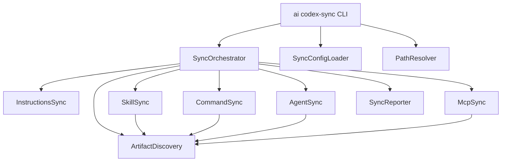
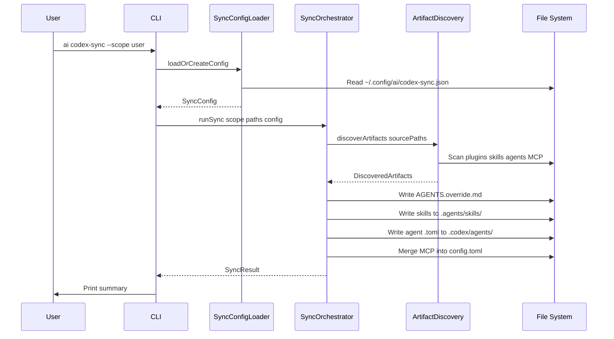

# Design Document: codex-sync

## Overview
**Purpose**: This feature delivers a CLI subcommand (`ai codex-sync`) that synchronizes Claude Code configuration into OpenAI Codex CLI configuration. Claude Code is the source of truth — custom instructions, skills, agents, and MCP server configurations are discovered, converted, and written to Codex-compatible paths.

**Users**: Developers who use both Claude Code and Codex CLI will use this to keep both tools' configurations in sync without manual file conversion.

**Impact**: Adds a new subcommand to the existing `ai` CLI, two new npm dependencies (`gray-matter`, `smol-toml`), and a new library module (`typescript/lib/codex-sync/`).

### Goals
- Sync custom instructions (CLAUDE.md → AGENTS.override.md)
- Sync skills (from plugins AND standalone `.claude/skills/`) with frontmatter adaptation
- Convert commands (`.claude/commands/`) to Codex skills with frontmatter adaptation
- Convert agents from .md to .toml format with configurable model mapping
- Sync MCP server config from JSON to TOML with merge
- Support user-level and project-level scopes independently

### Non-Goals
- Bidirectional sync (Codex → Claude Code)
- Syncing Claude Code permissions/hooks (no Codex equivalent)
- Automatic invocation or watch mode
- Managing Codex CLI installation or updates

## Architecture

> See `research.md` for full discovery notes on MCP location correction and standalone subagent discovery.

### Architecture Pattern & Boundary Map



**Architecture Integration**:
- Selected pattern: Pipeline (Discover → Convert → Write) coordinated by an orchestrator
- Domain boundaries: Discovery reads Claude Code files; converters transform data; writers output Codex files
- Existing patterns preserved: Commander.js CLI registration, Zod schema validation with `.passthrough()`, dependency injection
- New components rationale: Each sync artifact type (instructions, skills, commands, agents, MCP) has distinct conversion logic warranting separate modules
- Steering compliance: TypeScript strict mode, plain functions, early returns, YAGNI

### Technology Stack

| Layer | Choice / Version | Role in Feature | Notes |
|-------|------------------|-----------------|-------|
| CLI | Commander.js (existing) | Subcommand registration, option parsing | Follows existing `ai.ts` patterns |
| Runtime | Bun (existing) | Script execution, file I/O | Used by all existing scripts |
| TOML | `smol-toml` | Parse and serialize TOML for config.toml and agent .toml files | ESM-native, zero deps, TypeScript types |
| Frontmatter | `gray-matter` | Parse YAML frontmatter from SKILL.md and agent .md files | Handles multiline YAML values correctly |
| Validation | Zod (existing) | Schema validation for config files and frontmatter | `.passthrough()` for forward compatibility |

## System Flows



## Requirements Traceability

| Requirement | Summary | Components | Interfaces |
|-------------|---------|------------|------------|
| 1.1–1.7 | CLI subcommand with scope and summary | CLI registration, SyncReporter | `runCodexSync()` |
| 2.1–2.6 | Config file with model mapping | SyncConfigLoader | `loadOrCreateSyncConfig()` |
| 3.1–3.4 | CLAUDE.md → AGENTS.override.md | InstructionsSync | `syncInstructions()` |
| 4.1–4.10 | Skills sync with frontmatter strip (plugins + standalone) | SkillSync, ArtifactDiscovery | `syncSkills()`, `convertSkillFrontmatter()`, `discoverStandaloneSkills()` |
| 5.1–5.13 | Agent .md → .toml conversion | AgentSync, ArtifactDiscovery | `syncAgents()`, `convertAgentToToml()` |
| 6.1–6.10 | MCP JSON → config.toml merge | McpSync | `syncMcpServers()`, `mergeTomlMcpServers()` |
| 7.1–7.7 | Validation and error reporting | All converters, SyncReporter | Zod schemas, `SyncResult` |
| 8.1–8.9 | Path resolution per scope | PathResolver | `resolveSyncPaths()` |
| 9.1–9.12 | Commands → Codex skills conversion | CommandSync, ArtifactDiscovery | `syncCommands()`, `discoverCommands()` |

## Components and Interfaces

| Component | Domain | Intent | Req Coverage | Key Dependencies | Contracts |
|-----------|--------|--------|--------------|-----------------|-----------|
| CLI Registration | CLI | Register codex-sync subcommand | 1.1–1.7 | Commander.js (P0) | — |
| SyncConfigLoader | Config | Load, create, validate sync config | 2.1–2.6 | Zod (P0), fs (P0) | Service |
| PathResolver | Config | Resolve source/dest paths per scope | 8.1–8.9 | — | Service |
| ArtifactDiscovery | Discovery | Find plugins, standalone skills, commands, agents, MCP | 4.1–4.2, 5.1–5.2, 6.1–6.2, 9.1–9.3 | fs (P0), gray-matter (P1) | Service |
| InstructionsSync | Sync | Copy CLAUDE.md to AGENTS.override.md | 3.1–3.4 | fs (P0) | Service |
| SkillSync | Sync | Copy skills, strip frontmatter | 4.3–4.10 | gray-matter (P0) | Service |
| CommandSync | Sync | Convert commands to Codex skills | 9.4–9.12 | gray-matter (P0) | Service |
| AgentSync | Sync | Convert agent .md to .toml | 5.3–5.13 | gray-matter (P0), smol-toml (P0) | Service |
| McpSync | Sync | Convert MCP JSON to config.toml | 6.3–6.10 | smol-toml (P0) | Service |
| SyncOrchestrator | Orchestration | Run full sync pipeline | 1.6–1.7, 7.5–7.7 | All sync components (P0) | Service |
| SyncReporter | Reporting | Track and display sync results | 1.6–1.7, 7.6–7.7 | — | Service |

### Config Layer

#### SyncConfigLoader

| Field | Detail |
|-------|--------|
| Intent | Load, auto-create, and validate the sync configuration file |
| Requirements | 2.1, 2.2, 2.3, 2.4, 2.5, 2.6 |

**Responsibilities & Constraints**
- Load config from `~/.config/ai/codex-sync.json`
- Create with defaults if missing, log creation to user
- Validate against Zod schema; exit on validation failure

**Dependencies**
- External: Zod — schema validation (P0)
- External: Node fs — file read/write (P0)

**Contracts**: Service [x]

##### Service Interface
```typescript
interface SyncConfig {
  modelMapping: Record<string, string>;
}

const SyncConfigSchema: z.ZodType<SyncConfig>; // with .passthrough()

const DEFAULT_SYNC_CONFIG: SyncConfig = {
  modelMapping: {
    sonnet: "gpt-5.3-codex-spark",
    opus: "gpt-5.4",
    haiku: "gpt-5.3-codex-spark",
  },
};

function loadOrCreateSyncConfig(): SyncConfig;
// Preconditions: File system writable at ~/.config/ai/
// Postconditions: Returns validated config; file exists on disk
// Errors: Exits process with non-zero code if validation fails
```

#### PathResolver

| Field | Detail |
|-------|--------|
| Intent | Resolve all source and destination file paths based on scope |
| Requirements | 8.1, 8.2, 8.3, 8.4, 8.5, 8.6, 8.7, 8.8, 8.9 |

**Responsibilities & Constraints**
- Map scope to concrete file system paths
- Create destination directories if they don't exist

##### Service Interface
```typescript
interface SyncPaths {
  // Source paths (Claude Code)
  claudeMdSource: string;
  pluginScanRoot: string;   // root dir to recursively scan for */.claude-plugin/plugin.json
  standaloneSkillsDir: string;  // .claude/skills/ — standalone skills not in any plugin
  commandsDir: string;          // .claude/commands/ — command .md files
  standaloneAgentsDir: string;
  mcpConfigSource: string;

  // Destination paths (Codex)
  agentsOverrideDest: string;
  codexSkillsDir: string;
  codexAgentsDir: string;
  codexConfigDir: string;
}

function resolveSyncPaths(scope: "user" | "project"): SyncPaths;
// "user" → pluginScanRoot = ~/.claude/plugins/, standaloneSkillsDir = ~/.claude/skills/, commandsDir = ~/.claude/commands/
// "project" → pluginScanRoot = CWD (recursive scan), standaloneSkillsDir = ./.claude/skills/, commandsDir = ./.claude/commands/
```

**Path mapping:**

| Artifact | User Source | User Dest | Project Source | Project Dest |
|----------|-----------|----------|---------------|-------------|
| Instructions | `~/.claude/CLAUDE.md` | `~/.codex/AGENTS.override.md` | `./CLAUDE.md` | `./AGENTS.override.md` |
| Plugin Skills | `~/.claude/plugins/` (scan) | `~/.agents/skills/` | CWD recursive `**/.claude-plugin/plugin.json` | `./.agents/skills/` |
| Standalone Skills | `~/.claude/skills/` | `~/.agents/skills/` | `./.claude/skills/` | `./.agents/skills/` |
| Commands | `~/.claude/commands/` | `~/.agents/skills/` | `./.claude/commands/` | `./.agents/skills/` |
| Plugin Agents | `~/.claude/plugins/` (scan) | `~/.codex/agents/` | CWD recursive `**/.claude-plugin/plugin.json` | `./.codex/agents/` |
| Standalone Agents | `~/.claude/agents/` | `~/.codex/agents/` | `./.claude/agents/` | `./.codex/agents/` |
| MCP Servers | `~/.claude.json` | `~/.codex/config.toml` | `./.mcp.json` | `./.codex/config.toml` |

### Discovery Layer

#### ArtifactDiscovery

| Field | Detail |
|-------|--------|
| Intent | Discover all Claude Code artifacts (plugins, standalone skills, commands, agents, MCP config) from source paths |
| Requirements | 4.1, 4.2, 5.1, 5.2, 6.1, 6.2, 9.1, 9.2, 9.3 |

**Responsibilities & Constraints**
- Scan for plugin directories by recursively locating `*/.claude-plugin/plugin.json` files under `pluginScanRoot`, skipping `node_modules`, `dist`, `.git`, and dotfile directories (except `.claude-plugin`)
- Extract skill directories from discovered plugins (each subdirectory of `skills/` containing a `SKILL.md`)
- Discover standalone skill directories from `.claude/skills/` (same format as plugin skills — subdirectories containing `SKILL.md`)
- Discover command `.md` files from `.claude/commands/` recursively, supporting namespace subdirectories
- Extract agent `.md` files from discovered plugins AND standalone agent directories, applying agent candidate filtering (see below)
- Parse MCP server entries from the appropriate JSON file

**Agent Candidate Filtering**
- Only `.md` files directly inside `agents/` or one subdirectory level deep (e.g., `agents/design/*.md`) are candidates
- Exclude files inside support directories: `references/`, `assets/`, `scripts/`
- A candidate must contain YAML frontmatter with at least `name` and `description` fields; files without valid frontmatter are silently skipped (not counted as failures)

**Dependencies**
- External: Node fs — directory traversal (P0)
- External: gray-matter — frontmatter parsing for validation (P1)

##### Service Interface
```typescript
interface DiscoveredSkill {
  name: string;
  sourceDir: string;      // full path to skill directory
  skillMdPath: string;    // full path to SKILL.md
}

interface DiscoveredAgent {
  name: string;
  sourcePath: string;     // full path to agent .md file
  source: "plugin" | "standalone";
}

interface DiscoveredMcpServer {
  id: string;
  command: string;
  args: string[];
  env: Record<string, string>;
}

interface DiscoveredCommand {
  name: string;           // derived from path or frontmatter
  sourcePath: string;     // full path to command .md file
}

interface DiscoveredArtifacts {
  skills: DiscoveredSkill[];
  commands: DiscoveredCommand[];
  agents: DiscoveredAgent[];
  mcpServers: DiscoveredMcpServer[];
  claudeMdExists: boolean;
}

function discoverStandaloneSkills(skillsDir: string): DiscoveredSkill[];
// Scans .claude/skills/ for skill directories containing SKILL.md

function discoverCommands(commandsDir: string): DiscoveredCommand[];
// Recursively scans .claude/commands/ for .md files
// Derives name from path: "audit.md" → "audit", "kiro/spec-init.md" → "kiro--spec-init"

function discoverArtifacts(paths: SyncPaths): DiscoveredArtifacts;
```

### Sync Layer

#### InstructionsSync

| Field | Detail |
|-------|--------|
| Intent | Copy CLAUDE.md to AGENTS.override.md |
| Requirements | 3.1, 3.2, 3.3, 3.4 |

**Responsibilities & Constraints**
- Simple file copy with rename
- Warn and skip if source doesn't exist
- Overwrite destination if it exists

##### Service Interface
```typescript
function syncInstructions(
  sourcePath: string,
  destPath: string,
): SyncItemResult;
```

#### SkillSync

| Field | Detail |
|-------|--------|
| Intent | Copy skill directories, stripping unsupported frontmatter from SKILL.md |
| Requirements | 4.3, 4.4, 4.5, 4.6, 4.7, 4.8, 4.9, 4.10 |

**Responsibilities & Constraints**
- Copy entire skill directory (SKILL.md, scripts/, references/, assets/)
- Strip `allowed-tools` and `argument-hint` from SKILL.md frontmatter
- Preserve `name`, `description`, and body content unchanged
- Overwrite existing skills with same name; preserve non-conflicting skills

**Dependencies**
- External: gray-matter — frontmatter parse/stringify (P0)

##### Service Interface
```typescript
const SkillFrontmatterSchema = z.object({
  name: z.string(),
  description: z.string(),
}).passthrough();

function convertSkillFrontmatter(content: string): string;
// Parses frontmatter, removes allowed-tools and argument-hint,
// reconstructs file with cleaned frontmatter + original body

function syncSkills(
  skills: DiscoveredSkill[],
  destDir: string,
): SyncItemResult[];
```

#### CommandSync

| Field | Detail |
|-------|--------|
| Intent | Convert Claude Code command .md files to Codex skill directories |
| Requirements | 9.4, 9.5, 9.6, 9.7, 9.8, 9.9, 9.10, 9.11, 9.12 |

**Responsibilities & Constraints**
- Convert each command `.md` file to a skill directory with `SKILL.md`
- Derive skill name from file path: top-level `foo.md` → `foo`, nested `ns/bar.md` → `ns--bar`
- Strip `allowed-tools`, `argument-hint`, and `required-context` from frontmatter
- Inject `name` field into frontmatter if not present, using derived name
- Validate command frontmatter for required `description` field
- Write to same destination as regular skills (`codexSkillsDir`)

**Dependencies**
- External: gray-matter — frontmatter parse/stringify (P0)

##### Service Interface
```typescript
const CommandFrontmatterSchema = z.object({
  description: z.string(),
  name: z.string().optional(),
}).passthrough();

function convertCommandToSkill(content: string, derivedName: string): { content: string; warnings: string[] };
// Strips unsupported frontmatter, injects name if missing

function syncCommands(
  commands: DiscoveredCommand[],
  destDir: string,
): SyncItemResult[];
```

#### AgentSync

| Field | Detail |
|-------|--------|
| Intent | Convert Claude Code agent .md files to Codex .toml format |
| Requirements | 5.3, 5.4, 5.5, 5.6, 5.7, 5.8, 5.9, 5.10, 5.11, 5.12, 5.13 |

**Responsibilities & Constraints**
- Parse agent .md frontmatter, validating only `name`, `description`, and `model`
- Map `model` using configurable model mapping; warn and omit if no mapping
- Strip all fields except `name`, `description`, and mapped `model` (drops `color`, `tools`, and any other unsupported fields via post-parse filtering)
- Convert markdown body to TOML `developer_instructions` multi-line string
- Write `.toml` file per agent
- Handle subdirectory agents (e.g., `design/software-engineering-agent.md`) as individual agents

**Dependencies**
- External: gray-matter — frontmatter parsing (P0)
- External: smol-toml — TOML serialization (P0)
- Inbound: SyncConfig — model mapping (P0)

##### Service Interface
```typescript
// Only validate fields we use; dropped fields (color, tools) pass through
// via .passthrough() and are stripped post-parse — avoids rejecting valid
// agents whose dropped fields use unexpected YAML types (arrays, objects).
const AgentFrontmatterSchema = z.object({
  name: z.string(),
  description: z.string(),
  model: z.string().optional(),
}).passthrough();

interface CodexAgentToml {
  name: string;
  description: string;
  developer_instructions: string;
  model?: string;
}

function convertAgentToToml(
  agentMdContent: string,
  modelMapping: Record<string, string>,
): { toml: string; warnings: string[] };

function syncAgents(
  agents: DiscoveredAgent[],
  destDir: string,
  modelMapping: Record<string, string>,
): SyncItemResult[];
```

#### McpSync

| Field | Detail |
|-------|--------|
| Intent | Convert Claude Code MCP JSON config to Codex config.toml MCP sections |
| Requirements | 6.3, 6.4, 6.5, 6.6, 6.7, 6.8, 6.9, 6.10 |

**Responsibilities & Constraints**
- Parse MCP servers from `~/.claude.json` or `.mcp.json` (the `mcpServers` key)
- Convert each entry to TOML `[mcp_servers.<id>]` format
- Merge with existing config.toml: preserve all non-MCP sections, overwrite matching server IDs, preserve non-conflicting servers
- Handle missing source file gracefully (log info, skip)

**Dependencies**
- External: smol-toml — TOML parse/stringify (P0)

##### Service Interface
```typescript
const McpServerSchema = z.object({
  command: z.string(),
  args: z.array(z.string()).optional(),
  env: z.record(z.string()).optional(),
}).passthrough();

const McpConfigSchema = z.object({
  mcpServers: z.record(McpServerSchema).optional(),
}).passthrough();

function syncMcpServers(
  mcpSourcePath: string,
  codexConfigDir: string,
): SyncItemResult[];
// Reads mcpSourcePath JSON, parses mcpServers
// Reads existing config.toml from codexConfigDir if present
// Merges MCP entries, writes updated config.toml
```

### Orchestration Layer

#### SyncOrchestrator

| Field | Detail |
|-------|--------|
| Intent | Coordinate full sync pipeline and aggregate results |
| Requirements | 1.6, 1.7, 7.5, 7.6, 7.7 |

**Responsibilities & Constraints**
- Call each sync function in sequence: instructions → skills → commands → agents → MCP
- Aggregate all results into a final summary
- Continue processing when individual items fail (7.5)
- Return non-zero exit indicator when any items fail (7.7)

##### Service Interface
```typescript
interface SyncItemResult {
  artifact: string;       // e.g., "skill:commit" or "agent:code-reviewer"
  status: "synced" | "skipped" | "failed";
  destPath?: string;
  reason?: string;        // for skipped/failed
}

interface SyncResult {
  items: SyncItemResult[];
  hasErrors: boolean;
}

function runSync(
  paths: SyncPaths,
  config: SyncConfig,
): SyncResult;
```

#### SyncReporter

| Field | Detail |
|-------|--------|
| Intent | Format and display sync results to the user |
| Requirements | 1.6, 7.6 |

##### Service Interface
```typescript
function printSyncSummary(result: SyncResult): void;
// Prints:
//   Synced: N items
//   Skipped: N items (with reasons)
//   Failed: N items (with file paths and error messages)
```

## Data Models

### Domain Model

**Aggregates**:
- `SyncConfig`: User's persistent sync configuration (model mapping)
- `SyncPaths`: Resolved file system paths for a given scope
- `DiscoveredArtifacts`: All Claude Code artifacts found during discovery
- `SyncResult`: Aggregate outcome of the sync operation

**Value Objects**:
- `DiscoveredSkill`, `DiscoveredAgent`, `DiscoveredMcpServer`: Individual discovered items
- `SyncItemResult`: Outcome for a single synced item
- `CodexAgentToml`: Intermediate representation of a converted agent

**Business Rules**:
- Overwrite on name conflict; preserve non-conflicting items
- Model mapping is optional per agent; warn if unmapped
- Individual item failures do not halt the pipeline

### Logical Data Model

**Sync Config File** (`~/.config/ai/codex-sync.json`):
```typescript
{
  modelMapping: {
    [claudeModelId: string]: string  // codex model id
  }
}
```

**MCP Source Files** (`~/.claude.json` / `.mcp.json`):
```typescript
{
  mcpServers: {
    [serverId: string]: {
      command: string;
      args?: string[];
      env?: Record<string, string>;
    }
  }
}
```

**Codex Agent TOML** (`.codex/agents/<name>.toml`):
```toml
name = "agent-name"
description = "Agent description"
developer_instructions = """
Full markdown instructions from Claude Code agent body
"""
model = "gpt-5.4"  # optional, from model mapping
```

**Codex config.toml MCP section**:
```toml
[mcp_servers.server-name]
command = "executable"
args = ["arg1", "arg2"]

[mcp_servers.server-name.env]
API_KEY = "value"
```

## Error Handling

### Error Strategy
Fail-fast on config validation; continue-on-error for individual artifact sync. Aggregate all errors for final summary.

### Error Categories and Responses
- **Config validation failure** (fatal): Invalid sync config → display Zod errors, exit 1
- **Missing source file** (skip): CLAUDE.md or MCP config missing → log warning, continue
- **Frontmatter validation failure** (skip item): Invalid skill/agent frontmatter → log error with path, continue
- **TOML parse failure** (skip MCP): Existing config.toml is malformed → log error, skip MCP merge
- **File write failure** (fail item): Permission denied or disk error → log error with path, continue
- **Unmapped model** (warn): Agent model has no mapping → log warning, omit model from .toml, continue

## Testing Strategy

### Unit Tests
- `convertSkillFrontmatter()`: Verify `allowed-tools` and `argument-hint` stripped, `name`/`description` preserved
- `convertAgentToToml()`: Verify .md → .toml conversion, model mapping, unmapped model warning
- `syncMcpServers()` merge logic: Verify existing TOML preserved, MCP entries merged correctly
- `loadOrCreateSyncConfig()`: Verify creation with defaults, validation errors
- `resolveSyncPaths()`: Verify correct paths for each scope
- `discoverArtifacts()`: Verify plugin scanning, skill/agent/MCP discovery

### Integration Tests
- Full `runSync()` with a temp directory containing mock Claude Code structure → verify all Codex files created correctly
- Merge scenario: Pre-existing config.toml with non-MCP sections → verify they survive sync
- Overwrite scenario: Pre-existing Codex skills/agents → verify conflicting ones overwritten, others preserved

## File Organization

```
typescript/
  lib/
    codex-sync/
      sync-config.ts         # SyncConfigLoader, SyncConfigSchema
      path-resolver.ts        # PathResolver, SyncPaths
      artifact-discovery.ts   # ArtifactDiscovery, DiscoveredArtifacts
      instructions-sync.ts    # InstructionsSync
      skill-sync.ts           # SkillSync, convertSkillFrontmatter
      command-sync.ts         # CommandSync, convertCommandToSkill
      agent-sync.ts           # AgentSync, convertAgentToToml
      mcp-sync.ts             # McpSync, mergeTomlMcpServers
      sync-orchestrator.ts    # SyncOrchestrator, runSync
      sync-reporter.ts        # SyncReporter, printSyncSummary
      schemas.ts              # Shared Zod schemas
      types.ts                # Shared TypeScript types
  scripts/
    ai.ts                     # Updated: register codex-sync subcommand
```
