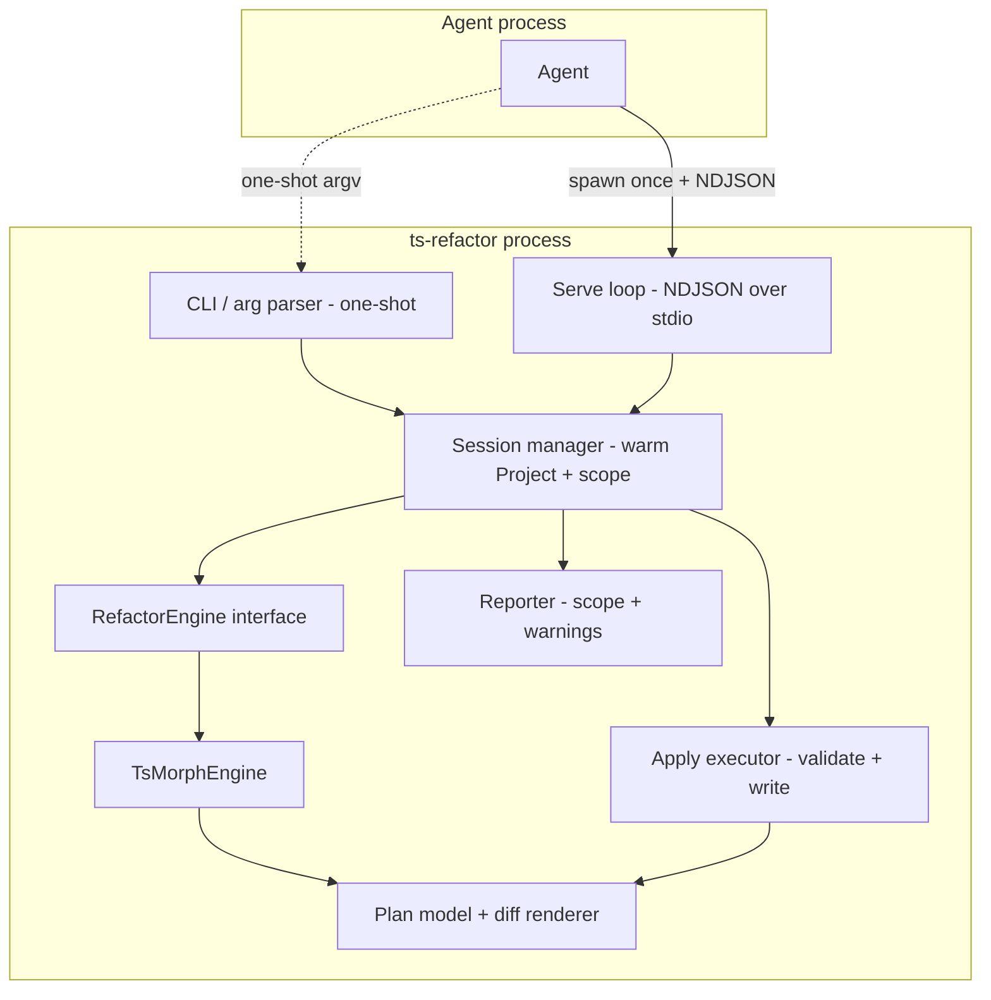
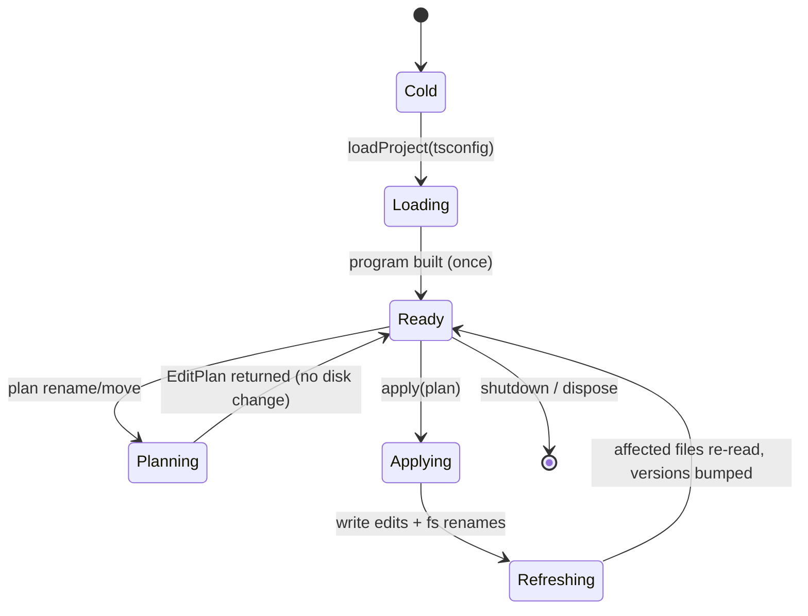
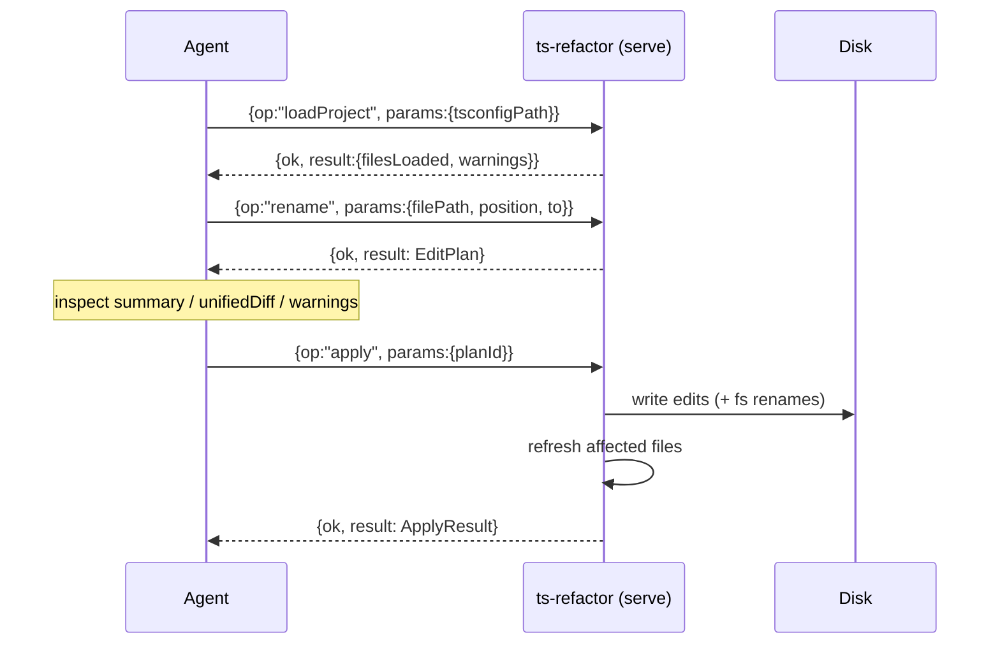

# Design Document: ts-refactor-cli

## Overview

**Purpose**: A fast, agent-facing CLI that performs semantically-correct TypeScript refactors — renaming symbols, renaming/moving files and directories, and updating every reference to the changed symbol or file — without standing up an editor language-server (`tsserver`/LSP) daemon.

**Users**: AI coding agents (and, secondarily, humans/scripts) that need to apply mechanical-but-correctness-sensitive refactors across a TypeScript codebase. The tool is optimized for machine consumption: deterministic addressing, machine-readable edit plans, inspectable and hash-verified output, and warm-process speed.

**Impact**: Adds a new binary (`ts-refactor`) built from `typescript/` alongside the existing `ai` CLI — using the same `bun build … --outdir=dist --target=bun` + `package.json` `bin` pattern as `ai` (output `dist/ts-refactor.js`), **not** a `--compile` standalone-executable pattern. Plus a new library module `typescript/lib/ts-refactor/`. Introduces one runtime dependency, `ts-morph` (which transitively pulls `typescript`). No changes to existing installers beyond registering the new binary.

### Objectives / Goals

- **Correct symbol rename**: rename a symbol identified by file + position and update all references, respecting scope, shadowing, re-exports/barrels, and aliased imports (`import { x as y }`).
- **Correct file/dir move & rename**: move or rename a file/directory and rewrite every import/export specifier that resolves to it. **MVP scope** honors relative specifiers, `baseUrl`, tsconfig `paths` aliases, extensions, and index files — each backed by a fixture (see [Testing Strategy](#testing-strategy)). Package `exports`/`imports` (subpath) rewriting and cross-package-boundary moves are **out of MVP scope**: such a move warns rather than silently guessing (see [Non-Goals](#non-goals)).
- **Plan/apply discipline**: every operation can produce an inspectable plan (machine-readable JSON edit list + human-readable unified diff) *without* touching disk; a separate apply step commits it.
- **Warm-process speed**: a long-lived `serve` mode keeps the TypeScript program in memory so repeated operations in an agent session pay the expensive program-build cost once.
- **Swappable semantic backend**: an engine seam isolates `ts-morph` (the initial backend) so the raw `LanguageService` — or `tsgo`/TS 7.0 later — can replace it without changing the CLI/protocol surface.
- **Honest scope reporting**: every result states what project graph was loaded and flags when a renamed symbol is reachable through a public entry point (so references *may* exist outside the loaded graph). This is a **scope heuristic, not reference detection** — absence of a flag is not a completeness guarantee (see [TsMorphEngine](#tsmorphengine)).

### Non-Goals

- **Not an LSP server.** No editor protocol, no diagnostics/completions/hover, no file watchers. (See [Process Model](#process-model--session-lifecycle) for the distinction.)
- **No raw-`LanguageService` or `tsgo` backend in the MVP.** The engine seam is built; only `TsMorphEngine` is implemented now.
- **No fast-parser accelerator path (oxc/swc/ast-grep) in the MVP.** Deferred; the seam allows adding a syntactic file-move fast path later.
- **No conflict/shadowing safety analysis beyond what TypeScript itself provides.** `findRenameLocations` does not reject renames that would shadow or collide; we surface warnings, not guarantees.
- **No cross-project/monorepo graph beyond a single loaded project (one tsconfig + its project references).** Multi-tsconfig orchestration is future work.
- **No symbol-name-based addressing.** Renames are addressed by file + position, never by bare name (the API needs a position to disambiguate).
- **No package `exports`/`imports` subpath rewriting on move (MVP).** Moves are correct for relative/`baseUrl`/`paths`/index/extension resolution; a move that crosses a package `exports` boundary warns instead of silently rewriting.

### Success Criteria

- Rename results match a `tsc`-based reference oracle on a fixture suite covering re-exports, barrels, aliased imports, namespace members, and overloads.
- In `serve` mode, the second and subsequent operations are dominated by find-references cost, not project-build cost (program built once).
- Memory plateaus rather than growing unbounded across a long session of many operations (validated by the `forgetNodesCreatedInBlock` discipline; see [Performance](#performance--scalability)).
- Plans are deterministic for a given project state, and apply is **staleness-gated**: it is rejected unless every target file still matches the hash it was planned against. Undoing an applied plan relies on the agent's version control (git worktree/branch), not on the plan itself — the plan is not self-reversing (see [Apply Layer](#apply-layer) and [Error Handling](#error-handling)).

### Requirements Traceability

`requirements.md` is generated (`spec.json`: `requirements.generated: true`; approval pending) with ten numbered requirements backfilled from this design. The requirements are authoritative for *what* the tool must do; this design owns *how*. Component → requirement map:

| Component / section | Requirement(s) |
|---------------------|----------------|
| TsMorphEngine `planRename` | R1 (Semantic Symbol Rename) |
| TsMorphEngine `planMove` / `planMoveDir` | R2 (File and Directory Move / Rename) |
| Plan model + diff renderer, `EditPlan`, plan-only CLI default | R3 (Plan / Apply Separation) |
| Apply executor | R4 (Safe Apply with Staleness Gating) |
| Session manager, `serve` mode | R5 (Warm Serve Session) |
| Serve loop, NDJSON protocol, CLI exit codes | R6 (NDJSON Protocol and CLI Transport) |
| Reporter, `ProjectScope` warnings | R7 (Honest Scope Reporting) |
| `RefactorEngine` seam + Plan-layer derivation | R8 (Swappable Semantic Backend) |
| Performance & memory discipline (`forgetNodesCreatedInBlock`, `status`) | R9 (Performance and Memory Discipline) |
| File Organization, build/`bin`, installer registration | R10 (Build and Packaging) |

## Background & Key Design Decisions

These decisions were settled during design discussion; rationale is summarized here so the document stays self-contained.

| # | Decision | Rationale | Deferred alternative |
|---|----------|-----------|----------------------|
| D1 | Keep TypeScript's **semantic engine**; only avoid the language-*server* process | Correct symbol rename requires scope/type resolution; pure syntactic rewriting silently corrupts (wrong same-named symbol, missed re-export) | Syntactic-only codemod (scoped down to a "fast helper", not a safe refactor tool) |
| D2 | **`ts-morph` end-to-end** for the first backend | Fastest path to a correct MVP; wraps the exact `findRenameLocations`/move primitives with far less host boilerplate | Raw `LanguageService` as the spine (more control, more code) |
| D3 | **Long-lived `serve` process** holds the program warm | The dominant runtime cost is program build + type-check; amortizing it across a session is the main speed lever | Cold one-shot per operation (kept as a fallback mode) |
| D4 | **Plan/apply split**; apply is an engine-agnostic validated writer | Agents need inspectable, independently hash-verifiable edits; decoupling apply keeps the engine seam about *planning* only | Direct mutate-and-save |
| D5 | **Position-addressed** renames (`file` + `line:col`/`offset`) | A position disambiguates shadowed/overloaded names; a bare name cannot | — |
| D6 | **`forgetNodesCreatedInBlock()`** around every operation | `ts-morph`'s wrapper-node cache is the main memory risk in a daemon; scoping wrapper lifetime bounds it | Raw LS (no wrapper layer) — deferred to D2's alternative |
| D7 | **Engine seam** (`RefactorEngine` interface) | Lets us migrate to raw LS / `tsgo` without touching CLI/protocol | — |
| D8 | **`getEditsForFileRename` is the move/move-dir backend** (non-mutating; directory-aware) | Spike-proven: rewrites relative/`baseUrl`/`paths`/index/extension importers and directory renames while leaving the warm session byte-identical, so planning needs no rollback | `ts-morph` `move()` + transactional rollback (mutates the session and missed `baseUrl`/`paths` importers in the spike) |

## Architecture

### Architecture Pattern & Boundary Map



**Architecture Integration**:
- **Selected pattern**: Session-managed engine behind a thin dispatch layer, with a plan/apply pipeline. One-shot and serve modes share the same session + engine code; only the transport differs.
- **Domain boundaries**: dispatch/transport (CLI args vs NDJSON) is separate from session lifecycle, which is separate from the semantic engine, which is separate from plan rendering and from the apply writer.
- **Existing patterns preserved**: Commander.js dispatch, the `typescript/` package's Bun build pattern (`bun build … --outdir=dist --target=bun`, `bin` → `dist/ts-refactor.js`, like `ai`), Zod validation at the protocol/plan boundary, plain functions over classes, early returns, YAGNI.
- **New components rationale**: each box owns one concern; the `RefactorEngine` seam (D7) is the only abstraction introduced for future flexibility, justified by the explicit backend-migration plan.
- **Steering compliance**: TypeScript strict mode, no `any`, Zod for runtime validation, kebab-case files, camelCase functions / PascalCase types.

### Technology Stack

| Layer | Choice / Version | Role in Feature | Notes |
|-------|------------------|-----------------|-------|
| CLI | Commander.js (existing) | Subcommand + option parsing for one-shot mode | Mirrors `ai.ts` patterns |
| Runtime | Bun (existing) | Execution, stdio loop, file I/O, build | `bun build scripts/ts-refactor.ts --outdir=dist --target=bun` → `dist/ts-refactor.js` (matches `ai`'s `bin` pattern) |
| Semantic engine | `ts-morph` (new) | Project/host management, `findRenameLocations`, file/dir move + specifier rewrite | Wraps `typescript`; engine isolated behind `RefactorEngine` |
| Type checker | `typescript` (transitive) | Program build, binder, find-references | Never run as `tsserver`; in-process only |
| Validation | Zod (existing) | Validate NDJSON requests and plan files at boundaries | `.strict()` on protocol input |

## Process Model & Session Lifecycle

The tool runs as a child process the agent spawns. The win over an LSP daemon is **not** "no separate process" — it is (a) the TS program stays warm across operations, (b) a deliberately minimal protocol carrying only our operations, and (c) we control project loading, invalidation, and memory. It does none of tsserver's interactive work (diagnostics, completions, watchers, auto-import index).



**Modes**:
- **One-shot** (`ts-refactor rename …`): Cold → Loading → Planning/Applying → exit. Simple; pays program build every invocation. For occasional use or CI.
- **Serve** (`ts-refactor serve`): stays in `Ready`, processing many requests against the warm program. The intended path for agent sessions doing multiple edits.

**Planning is non-destructive to the warm session**:
- *Rename* planning calls the language service's `findRenameLocations` (query-only, no mutation), mapping returned spans to edits.
- *Move* planning uses `ts.LanguageService.getEditsForFileRename(oldPath, newPath)` — the compiler's **non-mutating** file-rename edit API — which yields the specifier edits with no change to the in-memory project. **The same call accepts a directory path**, returning edits for every importer of every file under that directory in one query, so `moveDir` needs no per-file decomposition. A spike (fixture covering relative, `baseUrl`, `paths`-alias, index/barrel, explicit-extension, and the moved file's own imports, plus a directory rename) confirmed the call rewrites all of these correctly and leaves the warm `Project` byte-identical — paths, file membership, and text. Because planning is a pure query, no rollback machinery is required; the mutating `ts-morph` `move()` path is **not** used (in the spike it dirtied the session and missed `baseUrl`/`paths`-alias importers — see [Open Questions](#open-questions--future-work)).

**Apply** is engine-agnostic: it validates each target file's pre-edit hash (captured in the plan), writes text edits and performs fs renames, then asks the session to **refresh** affected source files (re-read + bump script versions), letting the language service reuse unchanged files incrementally.

## CLI Surface (one-shot mode)

All mutating commands default to **plan-only** (print plan to stdout, write nothing). `--apply` commits; `--plan-out <file>` writes the JSON plan; `--format json|diff|both` controls stdout rendering.

| Command | Purpose | Key options |
|---------|---------|-------------|
| `rename` | Rename a symbol at a position | `--file <p>` `--position <line:col>` \| `--offset <n>`, `--to <name>`, `--apply`, `--plan-out`, `--project <tsconfig>` |
| `move` | Move/rename one file | `--from <p>` `--to <p>`, `--apply`, `--plan-out`, `--project` |
| `move-dir` | Move/rename a directory | `--from <d>` `--to <d>`, `--apply`, `--plan-out`, `--project` |
| `apply` | Commit a previously produced plan | `--plan <file>`, `--allow-stale` (skip **content** staleness checks; emits a prominent warning; never skips destination-collision safety) |
| `serve` | Long-lived NDJSON session | `--project <tsconfig>` |

Positions are **1-based line, 1-based column** on the CLI (converted internally to TS offsets); `--offset` accepts a raw 0-based offset. Columns and offsets are **UTF-16 code units** (matching the TypeScript compiler), not Unicode code points or bytes.

Exit codes: `0` success; `2` user/usage error (bad position, missing file); `3` no renameable symbol at position; `4` apply rejected (stale plan / target changed); `5` internal engine error.

## Serve Protocol (NDJSON over stdio)

One JSON object per line, request and response. Deliberately minimal — only our operations.

```typescript
// Request
interface Request {
  id: string;                 // echoed on the response
  op: "loadProject" | "rename" | "move" | "moveDir" | "apply" | "status" | "shutdown";
  params?: unknown;           // validated per-op with Zod (.strict())
}

// Response
interface Response {
  id: string;
  ok: boolean;
  result?: unknown;           // EditPlan | ApplyResult | ProjectScope | StatusResult
  error?: { code: string; message: string };
}
```

Plan ops (`rename`/`move`/`moveDir`) return an `EditPlan` and do **not** change disk. `apply` takes either an inline `EditPlan` or a `planId` from an earlier plan in the same session. `status` reports loaded scope and memory; `shutdown` disposes and exits.

**Transport discipline**: in `serve` mode, **stdout carries only NDJSON responses** — one JSON object per line, nothing else. All logging, diagnostics, and human-readable progress go to **stderr**. (In one-shot mode the rendered plan from `--format` goes to stdout while warnings/logs go to stderr, so stdout stays machine-parseable.)

**Concurrency**: requests are processed **serially** per session. The warm `Project` and its language service are single-threaded and stateful (apply mutates files and bumps script versions), so a session handles one request at a time; pipelined requests are queued, not interleaved. Agents needing parallelism run multiple `serve` sessions (each pays its own program build).

## Plan Format (data contract)

The plan is the unit of inspection and the input to apply. It is engine-independent.

```typescript
interface Position { line: number; column: number; offset: number; } // all provided

interface TextEdit {
  start: Position;
  end: Position;
  newText: string;            // already incorporates any compiler-provided prefixText/suffixText (see TsMorphEngine.planRename)
}

interface FileEdits {
  filePath: string;           // absolute
  baseSha256: string;         // hash of file contents the edits were computed against
  edits: TextEdit[];          // non-overlapping, sorted by start
}

interface FileRename {
  from: string;               // absolute source path
  to: string;                 // absolute destination path
  fromSha256: string;         // hash of source contents the rename was planned against (staleness gate)
  overwrite: boolean;         // false = destination must not exist; true = explicit clobber allowed
}

// EditPlan is the Plan layer's output: it wraps the engine's PlanDraft
// (operation/fileEdits/fileRenames/scope) and adds the derived planId, summary,
// and unifiedDiff. Engines never construct these derived fields.
interface EditPlan {
  planId: string;             // stable id (content hash); also used to reference in serve apply
  operation: "rename" | "move" | "moveDir";
  fileEdits: FileEdits[];     // import/reference rewrites
  fileRenames: FileRename[];  // empty for rename
  scope: ProjectScope;        // what was loaded + warnings
  summary: {                  // for quick agent triage
    filesTouched: number;
    editCount: number;
    references: number;
  };
  unifiedDiff: string;        // human-readable rendering of fileEdits + renames
}

interface ProjectScope {
  tsconfigPath: string;
  filesLoaded: number;
  warnings: string[];         // heuristic, e.g., "symbol exported via public entry point; external references may exist and are not covered"
}
```

`planId` and `baseSha256` make apply **safe** (staleness-gated): apply refuses (exit 4 / `ok:false`) if any target file no longer matches its `baseSha256`, unless `--allow-stale`. Note: `baseSha256`/`fromSha256` are one-way fingerprints for change detection only — they do **not** store pre-edit content, so the plan is **not** self-reversing. Reversal of an applied plan relies on the agent working under version control (see [Apply Layer](#apply-layer) and the git-worktree assumption in [How Agents Use It](#guidance-for-agents)).

## Components and Interfaces

| Component | Layer | Intent | Key dependencies | Contracts |
|-----------|-------|--------|------------------|-----------|
| CLI dispatch | Transport | Parse argv, route to session, render output | Commander (P0) | — |
| Serve loop | Transport | NDJSON read/validate/dispatch/write | Zod (P0) | Service |
| Session manager | Session | Own warm `Project`, scope, refresh, memory discipline | RefactorEngine (P0) | Service, State |
| RefactorEngine (interface) | Engine | Planning seam; backend-agnostic | — | Service |
| TsMorphEngine | Engine | Implement planning via ts-morph | ts-morph (P0) | Service |
| Plan model + diff renderer | Plan | Derive `EditPlan` from the engine's `PlanDraft`: compute `planId`/`summary`/`unifiedDiff` | — | Batch |
| Apply executor | Apply | Validate hashes, write edits + renames | fs (P0) | Service |
| Reporter | Reporting | Summaries, warnings, scope, exit codes | — | Service |

### Engine Layer

#### RefactorEngine (interface)

| Field | Detail |
|-------|--------|
| Intent | Backend-agnostic planning seam (D7) so ts-morph can later be swapped for raw LS / tsgo |

```typescript
interface LoadProjectOptions {
  tsconfigPath: string;
  // Load the full project graph by default; only narrow when intentional (see Performance).
  scopeFiles?: string[];
}

// Rendering-free engine output. The Plan layer derives the full EditPlan from this
// by computing planId (content hash), summary, and unifiedDiff — so each backend
// implements planning only, never rendering/hashing (D7).
interface PlanDraft {
  operation: "rename" | "move" | "moveDir";
  fileEdits: FileEdits[];
  fileRenames: FileRename[];
  scope: ProjectScope;
}

interface RefactorEngine {
  loadProject(opts: LoadProjectOptions): ProjectScope;
  planRename(req: { filePath: string; offset: number; newName: string }): PlanDraft;
  planMove(req: { from: string; to: string }): PlanDraft;
  planMoveDir(req: { from: string; to: string }): PlanDraft;
  refreshFiles(absPaths: string[]): void;   // re-read after apply / external change
  dispose(): void;
}
```
- **Preconditions**: `loadProject` called before any `plan*`.
- **Postconditions**: `plan*` never writes to disk and leaves the in-memory project **structurally and textually identical to before the call** (and consistent with disk). Move planning achieves this **by construction** — `getEditsForFileRename` is a pure query (D8), so there is no in-memory mutation to undo.
- **Invariants**: returned `PlanDraft.fileEdits` are non-overlapping and carry a `baseSha256` matching current disk contents. `planId`, `summary`, and `unifiedDiff` are **not** the engine's job — the Plan layer computes them once for every backend.

#### TsMorphEngine

**Responsibilities & Constraints**
- Construct a single `ts-morph` `Project` from the tsconfig; reuse it across operations.
- `planRename`: call `project.getLanguageService().compilerObject.findRenameLocations(...)` (query-only). Each returned `RenameLocation` may carry optional `prefixText`/`suffixText` (TypeScript emits these for cases such as a shorthand-property rename `{ foo }` → `{ foo: newName }`); compose each edit's `newText` as `prefixText + newName + suffixText` — **a bare span replacement is incorrect** because it drops that compiler-provided text. Group edits by file.
- `planMove`/`planMoveDir`: call `project.getLanguageService().compilerObject.getEditsForFileRename(oldPath, newPath, formatSettings, preferences)` (non-mutating) to obtain the specifier edits, then build `fileEdits` + `fileRenames` from them with no change to the in-memory project. `planMoveDir` passes the directory paths to the **same** call — it returns edits for every importer under the directory, so no per-file decomposition is needed. The compiler chooses the rewritten specifier style (e.g. a `paths`-alias import may normalize to a `baseUrl` bare specifier); the result is resolvable, and `preferences.importModuleSpecifierPreference` is the tuning knob if a specific style is wanted. The mutating `sourceFile.move()`/`directory.move()` path is deliberately **not** used: a spike showed it both dirties the warm session and under-covers `baseUrl`/`paths`-alias importers (see [Open Questions](#open-questions--future-work)).
- **Wrap every operation's node usage in `project.forgetNodesCreatedInBlock(() => …)`** (D6) to bound the wrapper-node cache.
- Populate `ProjectScope.warnings` from **scope heuristics, not reference walking** — `findRenameLocations` only returns locations *inside* the loaded program and cannot see external consumers, so an "outside the graph" reference is undetectable by construction. The concrete trigger: warn when the renamed symbol's declaration is exported (directly or through a re-export/barrel) from a file that is a **public entry point** of the loaded project — a `package.json` `main`/`module`/`exports`/`types` target, or a tsconfig root/index barrel. The warning text must state that external references, if any, are **not** covered, and the design must document that *absence* of the warning is not a completeness guarantee.

**Dependencies**: ts-morph (P0), node:crypto for `baseSha256` (P0).

**Contracts**: Service [x]

### Session Layer

#### Session manager

| Field | Detail |
|-------|--------|
| Intent | Hold the warm engine/project, track scope, coordinate plan→apply→refresh, expose status |

**Responsibilities & Constraints**
- Lazily `loadProject` on first op (or eagerly in `serve` with `--project`).
- Hold a `planId → EditPlan` map for the session so `apply { planId }` works without re-sending the plan.
- After apply, call `engine.refreshFiles(affected)` so subsequent ops see committed state.
- `status` returns `ProjectScope`, `process.memoryUsage().heapUsed`, and counters (`operationCount`, `programBuildCount`) so the "program built once" criterion is directly observable rather than timing-inferred.

**Contracts**: Service [x] / State [x]

### Apply Layer

#### Apply executor

**Responsibilities & Constraints**
- **Atomic preflight — validate everything before writing anything:** for each `FileEdits`, check `baseSha256` against current disk; for each `FileRename`, check `fromSha256` against the current source file **and** check the destination per `overwrite` (must-not-exist unless `overwrite: true`). Abort the whole plan on any hash mismatch or destination collision unless `--allow-stale` — which relaxes **content hash** checks only, and **never** the destination-collision safety.
- Apply `TextEdit`s per file from end-to-start (so offsets stay valid), keyed by the file's **pre-rename** (`from`) path; **then** perform `fileRenames` (create parent dirs, `fs.rename`). A file that is both edited and renamed therefore has its edits written to `from` *before* it is moved to `to`.
- Return `ApplyResult { written: string[]; renamed: FileRename[]; }`.
- **Not crash-atomic across files:** writes and renames happen sequentially with no journal, so a crash mid-batch can leave a partially-applied tree. This is an accepted trade-off given the git-worktree assumption (the agent reverts via VCS); the executor keeps no backups and the plan is not self-reversing (it stores hashes, not pre-edit content). Callers needing all-or-nothing should snapshot via git before apply.

## How Agents Use It

The tool is designed around a **plan → inspect → apply** loop, with a warm session for speed.

### Recommended workflow (serve mode)



1. **Spawn once** per repo/session: `ts-refactor serve --project tsconfig.json`. Keep the process open; reuse it for every refactor in the session.
2. **Locate the symbol first.** The tool will not guess which symbol a bare name means. Find the declaration/usage position (e.g., via your search/read tooling) and pass `filePath` + `position`. For "rename this symbol everywhere", point at its declaration.
3. **Plan, then read the plan.** Inspect `summary` (filesTouched/references) and `warnings` (public-entry-point scope flags — a signal that references *may* exist outside the loaded graph; absence is not a completeness guarantee). The `unifiedDiff` is for human/agent review; the `fileEdits` are for programmatic checks.
4. **Apply by `planId`.** Commit when satisfied. Re-planning after external edits is cheap (warm program); stale applies are rejected by hash.
5. **Verify out-of-band.** The tool does not type-check after applying. Run your own `tsc --noEmit` (or the project's check) to confirm the result compiles — recommended after any batch of refactors.

### One-shot examples (no warm session)

```bash
# Plan only (writes nothing) — inspect the diff
ts-refactor rename --file src/auth/user.ts --position 12:8 --to AccountId --format diff

# Commit directly when confident
ts-refactor rename --file src/auth/user.ts --position 12:8 --to AccountId --apply

# Move a file and rewrite all importers; save the plan for audit
ts-refactor move --from src/util/date.ts --to src/time/date.ts --plan-out /tmp/move.json
ts-refactor apply --plan /tmp/move.json
```

### Guidance for agents

- **Prefer serve mode** when doing more than ~2 operations on one repo — the first op pays program build; the rest are fast.
- **Treat scope warnings as correctness signals**, not noise: a warning means the renamed symbol is reachable through a public entry point, so references *may* exist outside the loaded graph and would **not** be updated — widen the loaded project or handle external consumers explicitly. Conversely, **absence of a warning is not proof of completeness**: the "update every reference" guarantee holds only within the loaded program.
- **Work in a git worktree/branch** so applied changes are trivially reversible **via VCS** — the plan itself is not self-reversing and the executor intentionally keeps no separate backup.
- **Don't pass a bare symbol name** expecting a global rename — that's the unsafe syntactic pattern this tool exists to avoid.

## Data Models

### Domain Model
- **Session** (aggregate): warm `Project` + `ProjectScope` + `planId → EditPlan` map. Lifecycle in [Process Model](#process-model--session-lifecycle).
- **EditPlan** (aggregate): the reviewable/applyable unit; immutable once produced.
- **Value objects**: `Position`, `TextEdit`, `FileEdits`, `FileRename`, `ProjectScope`, `ApplyResult`.

### Validation
- All NDJSON request `params` and any loaded plan file are validated with Zod (`.strict()` on input) before use.
- `EditPlan` round-trips through JSON losslessly so a plan produced one-shot can be applied later or in serve mode.

## Error Handling

### Error Strategy
Fail-fast on usage/protocol errors; reject-and-report on unsafe applies; continue the session on per-request errors (serve mode never crashes the process on a bad request).

### Error Categories and Responses

| Category | Example | Response |
|----------|---------|----------|
| Usage (exit 2) | Missing file, malformed position | Reject request with `error.code = "usage"`; session stays alive |
| No symbol (exit 3) | Position resolves to no renameable symbol | `error.code = "no_symbol"` with the resolved token, if any |
| Stale apply (exit 4) | A target file changed since planning | Abort whole apply (atomic); report mismatched files; suggest re-plan or `--allow-stale` |
| Out-of-scope risk (warning) | Renamed symbol is exported via a public entry point | Non-fatal `scope.warnings[]` (heuristic, not a detected reference); plan still returned. Absence ≠ completeness |
| Engine error (exit 5) | ts-morph/compiler throws | `error.code = "engine"`, message; in serve mode, log and keep the session |

Note (honest scoping): TypeScript's rename does **not** detect that a rename would shadow or collide with an existing binding. The tool does not add that analysis (Non-Goals); agents should rely on out-of-band type-checking to catch resulting errors.

## Performance & Scalability

- **Warm program is the lever (D3).** Program build + the type-checking needed to resolve references dominates latency and is identical regardless of backend. Serve mode pays it once; subsequent ops are dominated by `findRenameLocations`' find-references walk.
- **Memory discipline (D6).** Every operation wraps ts-morph node usage in `project.forgetNodesCreatedInBlock(() => …)` so the wrapper-node cache does not grow unbounded across a long session. `status` exposes `heapUsed` to validate the plateau.
- **Load the correct graph, not the smallest.** `loadProject` loads the full configured project (and its references) by default. `scopeFiles` narrows the set only for intentionally constrained operations, and any narrowing is reflected in `ProjectScope` so the agent knows the guarantee is scoped — under-loading silently misses references (worse than slower).
- **Targets are baseline-then-measure.** Establish warm-op latency and memory-plateau baselines on a representative repo via a spike rather than committing to absolute numbers up front. Success = warm ops not re-paying build cost, and heap plateauing over a long session.

## Testing Strategy

### Unit Tests
- `planRename`: locations → non-overlapping `TextEdit`s, grouped by file, with correct `baseSha256`; **`prefixText`/`suffixText` translation** — a shorthand-property rename (`{ foo }` → `{ foo: newName }`) asserts `newText` includes the compiler-provided suffix, and an aliased import (`import { x as y }`) is covered by fixture so alias behavior is verified rather than assumed.
- Position handling: 1-based `line:col` ↔ TS offset conversion in **UTF-16 code units**, incl. multibyte (astral/BMP) characters and CRLF.
- `planMove`/`planMoveDir`: specifier rewriting through relative/`baseUrl`/`paths`/index-file/extension cases and the moved file's own imports (one fixture each), plus a directory rename via a single `getEditsForFileRename` directory-path call; assert each rewritten importer still **resolves** rather than asserting an exact specifier style (the compiler may normalize a `paths` alias to a `baseUrl` specifier). **Post-plan session cleanliness** — after a plan-only move, assert the project's `SourceFile` paths, file membership, and emitted text are byte-identical to the pre-plan snapshot (regression guard for the non-mutating backend).
- Apply executor: end-to-start edit application keyed by **pre-rename** path; atomic preflight over **both** `fileEdits` (`baseSha256`) and `fileRenames` (`fromSha256` + destination-collision per `overwrite`); a file that is both edited and renamed (edits land on `from`, then `fs.rename` to `to`); rename + parent-dir creation; `--allow-stale` relaxes content hashes but still rejects destination collisions.

### Integration Tests (fixture project as the oracle)
- Rename a symbol referenced across files including a **re-export/barrel** and an **aliased import**; compare against a `tsc`-program reference set.
- Move a file imported via **each** covered resolution form — relative, `baseUrl`, tsconfig `paths` alias, index-file, explicit extension — one fixture per case; assert every importer updated and the project still resolves. A move crossing a package `exports` boundary asserts a warning (out of MVP scope), not a silent rewrite.
- Serve session: `loadProject` → many `rename`/`move` ops → assert program built once (`status.programBuildCount === 1`) and heap plateaus.
- Apply safety: mutate an edited target between plan and apply → assert rejection (exit 4); `--allow-stale` overrides. Mutate a *renamed* source between plan and apply (`fromSha256` mismatch) → assert rejection. Plan a rename whose destination already exists with `overwrite: false` → assert rejection even under `--allow-stale`.

### Performance
- Cold vs warm latency for the same rename; warm should not re-pay build.
- Heap-over-time across N operations with vs without `forgetNodesCreatedInBlock` (regression guard for D6).

## File Organization

```
typescript/
  lib/
    ts-refactor/
      engine/
        refactor-engine.ts     # RefactorEngine interface + shared types
        ts-morph-engine.ts     # TsMorphEngine (findRenameLocations, move, forgetNodesCreatedInBlock)
      session.ts               # Session manager (warm project, planId map, refresh, status)
      plan.ts                  # EditPlan model, builder, planId hashing
      diff.ts                  # unified-diff renderer
      apply.ts                 # apply executor (hash validation, write, rename)
      protocol.ts              # NDJSON request/response Zod schemas + dispatch
      reporter.ts              # summaries, warnings, exit codes
      types.ts                 # shared TS types (Position, TextEdit, ...)
  scripts/
    ts-refactor.ts             # binary entry: one-shot Commander commands + `serve` loop
```

Build: extend `typescript/package.json` `scripts.build` with `bun build scripts/ts-refactor.ts --outdir=dist --target=bun`, and add a `bin` entry `"ts-refactor": "dist/ts-refactor.js"` (same shape as `ai` → `dist/ai.js`). The `bin` entry is the registration mechanism: like the existing `ai` and `json-to-schema` binaries, `ts-refactor` is exposed on `PATH` via the package's `bin` map plus a manual `bun link` (per `typescript/README.md`) — `install-user.ts` does **not** register any package binary, so no installer change is required for parity with the others. This follows the `typescript/` package's JS-output + `bin` pattern, **not** a `bun build --compile --outfile` standalone-executable pattern. If a true self-contained executable is later wanted for `ts-refactor` (faster cold start, no Bun on PATH), that is a deliberate divergence requiring `--compile --outfile dist/ts-refactor` plus executable-bit handling in the installer.

## Open Questions / Future Work

- **Raw `LanguageService` backend** (D2 alternative): implement a second `RefactorEngine` for tighter host/version/memory control once the wrapper layer is shown to be the bottleneck.
- **`tsgo`/TS 7.0 backend**: adopt as a third engine once its programmatic rename/file-rename surface, parity, and project-config support are verified for our environment.
- **Syntactic file-move fast path** (oxc-resolver): a non-semantic move planner for the common case, gated behind the engine seam.
- **Rejected move fallback / resolution-mode coverage**: the `ts-morph` `move()`/`directory.move()` path is not used — the spike showed it mutates the warm session and misses `baseUrl`/`paths`-alias importers that `getEditsForFileRename` rewrites. The spike exercised `moduleResolution: bundler` only; `node16`/`nodenext` resolution and package `exports` boundaries (the latter already MVP-out) still need their own fixtures before relying on move there.
- **Multi-tsconfig/monorepo**: orchestrate renames across project boundaries rather than a single loaded graph.
- **Binary vs `ai` subcommand**: this design proposes a separate `ts-refactor` binary built with the `typescript/` package's `--outdir`/`bin` pattern (serve ergonomics); revisit if a single `ai refactor …` subcommand is preferred.
- **Non-git plan reversal**: if a use case ever needs to undo an applied plan *without* version control, store inverse edits (replaced spans) + pre-rename source content in the plan so it becomes self-reversing — deliberately deferred to keep plans small, since the tool assumes a git worktree (see [Apply Layer](#apply-layer)). Surface this as a numbered requirement if it is actually needed.
