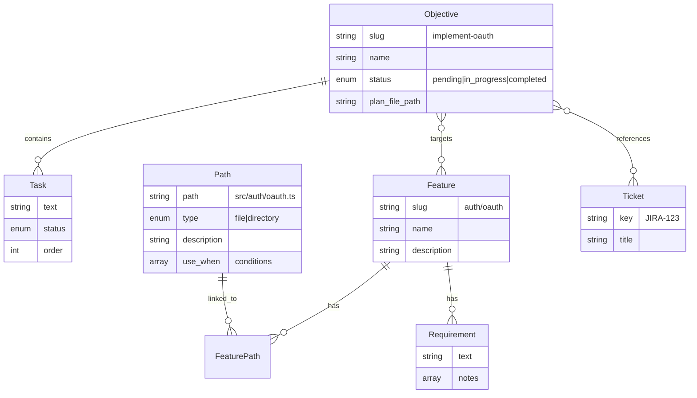

# Memory Bank MCP Server

MCP server providing structured memory management via per-project SQLite database. Enables hierarchical feature tracking, file/directory associations, requirements, objectives, tasks, and external ticket references.

**Database location**: `.claude/memory-bank.db` (created on first tool call)

## Domain Model



### Entity Descriptions

- **Feature**: Hierarchical project capability (slug format: `auth`, `auth/oauth`, `user-management/roles`)
- **Path**: Project-relative file or directory with metadata for context retrieval
- **Requirement**: Specification linked to one feature; includes notes array for clarifications
- **Objective**: Current work goal with status tracking; links to features and tickets
- **Task**: Ordered action item within objective
- **Ticket**: External reference (JIRA, GitHub issue)

### Key Relationships

- Feature → Paths: Many-to-many (path can belong to multiple features)
- Feature → Requirements: One-to-many (requirement belongs to one feature)
- Objective → Features: Many-to-many (objective targets multiple features)
- Objective → Tasks: One-to-many (task belongs to one objective)
- Objective → Tickets: Many-to-many (objective references external tickets)

## Data Conventions

### Slugs

- Format: `^[a-z0-9]+(-[a-z0-9]+)*(\/[a-z0-9]+(-[a-z0-9]+)*)*$`
- Lowercase alphanumeric with hyphens, forward slashes for hierarchy
- ✅ `auth`, `auth/oauth`, `user-management/roles`
- ❌ `Auth`, `auth_oauth`, `auth/`

### Status Values

- `pending`: Not started
- `in_progress`: Currently active
- `completed`: Finished

### Path Types

- `file`: Single file (e.g., `src/auth/oauth.ts`)
- `directory`: Folder (e.g., `src/auth/`)

### IDs

- 12-character nanoid (URL-safe)
- Used for paths, requirements, tasks, tickets
- Slugs preferred for features and objectives

## Workflow Patterns

### Starting Work on Objective

1. Create or get objective: `create_objective` or `get_objective`
2. Link to relevant features: `link_objective_to_features`
3. Create tasks: `create_tasks`
4. Build context: `build_context` with objective_slug

### Recording Feature Knowledge

1. Create feature: `create_features`
2. Register relevant files: `create_paths`
3. Link paths to feature: `link_paths_to_feature`
4. Add requirements: `create_requirements`

### Finding Relevant Files

- By feature: `list_paths` with feature_slug
- By query: `find_relevant_paths` with search query
- Full context: `get_feature_context` for feature with paths and requirements

### Building Task Context

- Single objective: `get_objective_context` returns objective, tasks, linked features, tickets
- Comprehensive markdown: `build_context` generates formatted context document

## Tool Reference

### Features

| Tool              | Input                                          | Description                            |
| ----------------- | ---------------------------------------------- | -------------------------------------- |
| `create_features` | `{ features: [{ slug, name, description? }] }` | Create one or more features            |
| `get_feature`     | `{ slug }`                                     | Get feature by slug                    |
| `list_features`   | `{ parent_slug? }`                             | List features; filter by parent prefix |
| `update_feature`  | `{ slug, name?, description? }`                | Update feature                         |
| `delete_feature`  | `{ slug }`                                     | Delete feature (cascades)              |

### Paths

| Tool                       | Input                                                  | Description              |
| -------------------------- | ------------------------------------------------------ | ------------------------ |
| `create_paths`             | `{ paths: [{ path, type, description?, use_when? }] }` | Create paths             |
| `get_path`                 | `{ id? } \| { path? }`                                 | Get by ID or path string |
| `list_paths`               | `{ feature_slug?, type? }`                             | List paths with filters  |
| `update_path`              | `{ id, description?, use_when? }`                      | Update path metadata     |
| `delete_path`              | `{ id }`                                               | Delete path              |
| `link_paths_to_feature`    | `{ feature_slug, path_ids }`                           | Link paths to feature    |
| `unlink_path_from_feature` | `{ feature_slug, path_id }`                            | Remove link              |

### Requirements

| Tool                  | Input                                                | Description         |
| --------------------- | ---------------------------------------------------- | ------------------- |
| `create_requirements` | `{ feature_slug, requirements: [{ text, notes? }] }` | Create requirements |
| `get_requirement`     | `{ id }`                                             | Get by ID           |
| `list_requirements`   | `{ feature_slug }`                                   | List for feature    |
| `update_requirement`  | `{ id, text?, notes? }`                              | Update requirement  |
| `delete_requirement`  | `{ id }`                                             | Delete requirement  |

### Objectives

| Tool                            | Input                                                     | Description                       |
| ------------------------------- | --------------------------------------------------------- | --------------------------------- |
| `create_objective`              | `{ slug, name, description?, status?, plan_file_path? }`  | Create objective                  |
| `get_objective`                 | `{ slug }`                                                | Get by slug                       |
| `list_objectives`               | `{ status? }`                                             | List objectives; filter by status |
| `update_objective`              | `{ slug, name?, description?, status?, plan_file_path? }` | Update objective                  |
| `delete_objective`              | `{ slug }`                                                | Delete objective (cascades)       |
| `link_objective_to_features`    | `{ objective_slug, feature_slugs }`                       | Link to features                  |
| `unlink_objective_from_feature` | `{ objective_slug, feature_slug }`                        | Remove link                       |
| `link_objective_to_tickets`     | `{ objective_slug, ticket_keys }`                         | Link to tickets                   |
| `unlink_objective_from_ticket`  | `{ objective_slug, ticket_key }`                          | Remove link                       |

### Tasks

| Tool            | Input                                            | Description                 |
| --------------- | ------------------------------------------------ | --------------------------- |
| `create_tasks`  | `{ objective_slug, tasks: [{ text, status? }] }` | Create tasks (auto-ordered) |
| `get_task`      | `{ id }`                                         | Get by ID                   |
| `list_tasks`    | `{ objective_slug, status? }`                    | List for objective          |
| `update_task`   | `{ id, text?, status? }`                         | Update task                 |
| `delete_task`   | `{ id }`                                         | Delete task                 |
| `reorder_tasks` | `{ objective_slug, task_ids }`                   | Set task order              |

### Tickets

| Tool             | Input                                          | Description              |
| ---------------- | ---------------------------------------------- | ------------------------ |
| `create_tickets` | `{ tickets: [{ key, title?, description? }] }` | Create tickets           |
| `get_ticket`     | `{ key }`                                      | Get by key               |
| `list_tickets`   | `{}`                                           | List all tickets         |
| `update_ticket`  | `{ key, title?, description? }`                | Update ticket            |
| `delete_ticket`  | `{ key }`                                      | Delete ticket (cascades) |

### Context

| Tool                    | Input                                 | Description                             |
| ----------------------- | ------------------------------------- | --------------------------------------- |
| `get_feature_context`   | `{ slug }`                            | Feature with paths and requirements     |
| `get_objective_context` | `{ slug }`                            | Objective with tasks, features, tickets |
| `find_relevant_paths`   | `{ query, feature_slugs?, type? }`    | Search paths by description/use_when    |
| `build_context`         | `{ objective_slug?, feature_slugs? }` | Generate comprehensive markdown context |

## Response Format

All tools return structured responses:

```json
// Success
{ "success": true, "data": { ... } }

// Error
{ "success": false, "error": { "type": "not_found", "message": "Feature 'x' not found" } }
```

Error types: `validation_error`, `not_found`, `constraint_violation`, `db_error`

## Best Practices

### Maintaining Memory Bank

- Create features for major project capabilities before starting work
- Register relevant paths with descriptive `use_when` conditions
- Link objectives to features to enable context building
- Update task status as work progresses
- Use `build_context` at session start for comprehensive context

### Effective use_when Conditions

- Write from agent perspective: "implementing authentication", "debugging OAuth flow"
- Include task types: "writing tests for", "refactoring", "adding feature to"
- Be specific but not overly narrow

### Slug Naming

- Use descriptive, hierarchical slugs: `api/endpoints/auth` not `auth-api-endpoints`
- Match project structure where appropriate
- Keep slugs stable; changing requires updating all references
