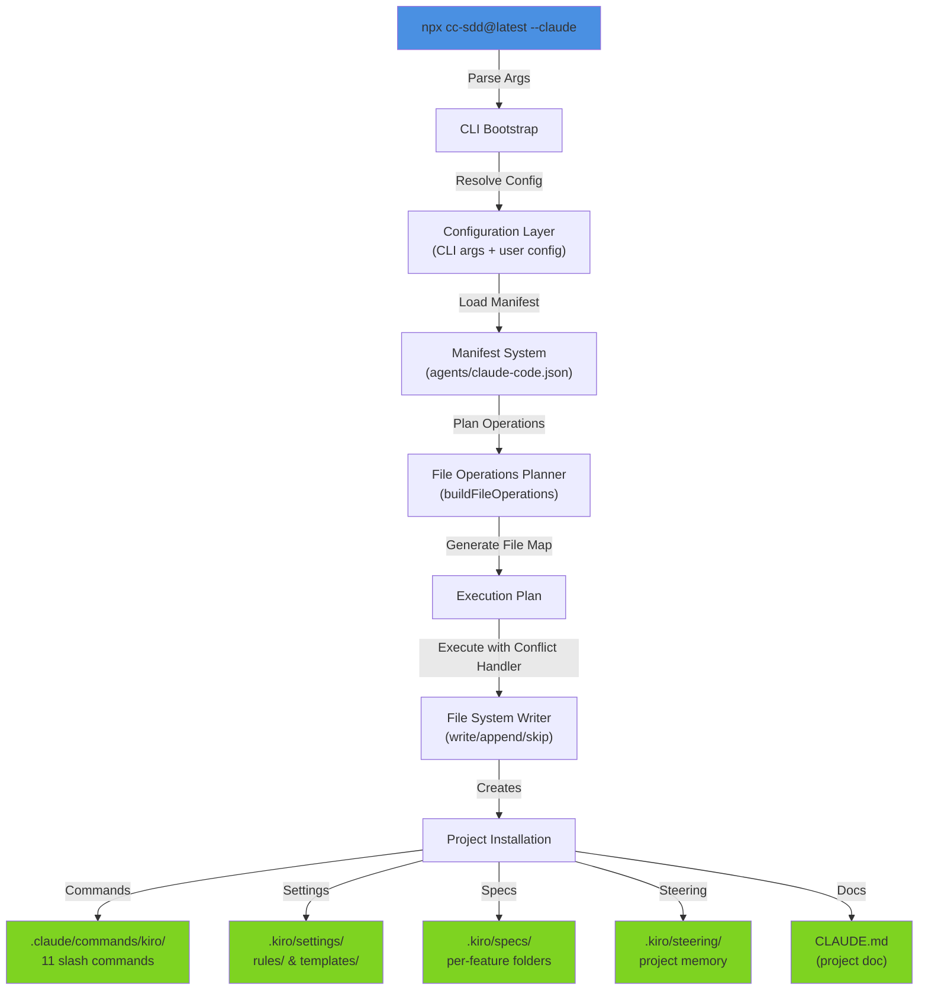
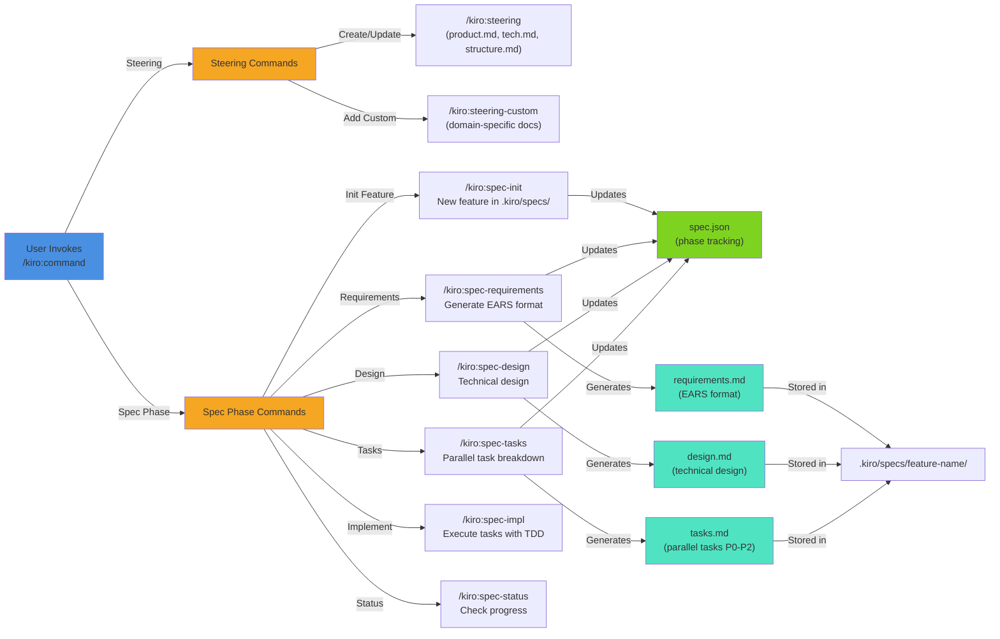
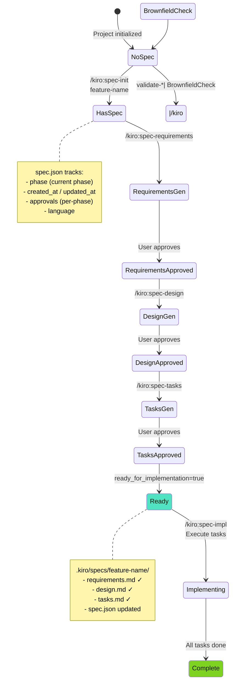
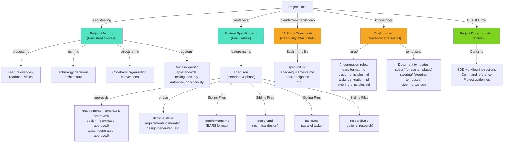
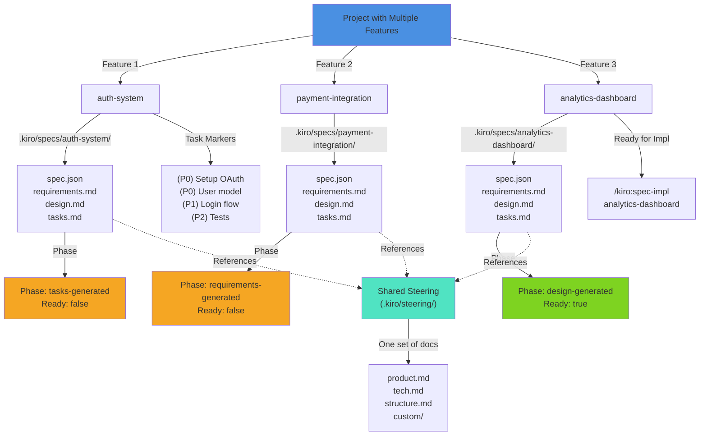

# cc-sdd Architecture Diagrams for Claude Code Agents

## Overview

cc-sdd (Claude Code Spec-Driven Development) is a CLI tool that installs spec-driven development workflows into AI coding environments. This document shows the relationships between Claude Code components, agents, commands, and persistent state files.

---

## Diagram 1: Installation & Component Architecture



**Purpose:** Shows how `cc-sdd --claude` installs the complete spec-driven development environment into a project.

---

## Diagram 2: Claude Code Slash Commands Workflow



**Purpose:** Illustrates all available slash commands and their relationships to spec phases and persistent state files.

---

## Diagram 3: Spec Workflow State Machine



**Purpose:** Shows the lifecycle of a feature spec from creation through implementation, with state tracked in `spec.json`.

---

## Diagram 4: Persistent State Files Structure



**Purpose:** Complete directory tree showing all persistent state files and their purposes.

---

## Diagram 5: Data Flow: From Command Invocation to Persistent State

```mermaid
sequenceDiagram
    participant User as User (Claude)
    participant Command as Slash Command<br/>(.md file)
    participant Agent as Claude Agent
    participant Template as Template System
    participant Parser as Content Parser
    participant FileSystem as File System

    User ->> Command: /kiro:spec-requirements
    Command ->> Agent: Load command definition
    Agent ->> Agent: Read steering docs<br/>(.kiro/steering/)
    Agent ->> Template: Render requirements<br/>template with context
    Template ->> Agent: Return template<br/>structure
    Agent ->> Agent: Generate requirements<br/>(EARS format)
    Agent ->> User: Show to user for approval
    User ->> User: Review & approve
    User ->> Agent: Confirm (via interaction)

    Agent ->> Parser: Parse generated content
    Parser ->> Parser: Extract EARS patterns<br/>Extract numbered criteria<br/>Validate structure
    Parser ->> FileSystem: Write requirements.md
    Parser ->> FileSystem: Update spec.json<br/>(approvals & phase)

    FileSystem ->> FileSystem: .kiro/specs/<br/>feature-name/

    note over FileSystem
        Now readable by:
        - Next command (/spec-design)
        - /spec-status check
        - /validate-* commands
    end note

    style Command fill:#f5a623
    style FileSystem fill:#7ed321
```

**Purpose:** Traces how a single command invocation transforms user intent into persistent state via templates and parsing.

---

## Diagram 6: Claude Code Agent Integration Points

```mermaid
graph TB
    A["Claude Code Editor"]

    A -->|"User types /kiro:"| B["Command Dispatcher<br/>(Claude Code built-in)"]

    B -->|"Route to"| C["Slash Command Loader<br/>(.claude/commands/kiro/)"]

    C -->|"Load & Parse"| D["11 Available Commands"]
    D -->|"Each loads"| D1["YAML Frontmatter<br/>(permissions)"]
    D -->|"Each loads"| D2["Markdown Body<br/>(instruction)"]
    D -->|"Reference"| D3["@steering files<br/>@spec files<br/>@template files"]
    D -->|"Execute"| D4["`!`bash` snippets<br/>Tool invocations"]

    D2 -->|"Execute Command"| E["Claude Agent<br/>(runs with context)"]

    E -->|"Read Current State"| F["State Files"]
    F -->|".kiro/specs/"| F1["spec.json<br/>requirements.md<br/>design.md<br/>tasks.md"]
    F -->|".kiro/steering/"| F2["product.md<br/>tech.md<br/>structure.md<br/>custom/"]

    E -->|"Generate Content"| G["Agent Output"]
    G -->|"Approval Workflow"| H["User Decision"]

    H -->|"Approved"| I["Write to State"]
    I -->|"Update"| F

    H -->|"Rejected"| J["Iterate<br/>or Cancel"]

    style A fill:#4a90e2
    style E fill:#f5a623
    style F fill:#50e3c2
    style I fill:#7ed321
```

**Purpose:** Shows how Claude Code environment integrates with the spec-driven workflow.

---

## Diagram 7: Multiple Features in Parallel



**Purpose:** Shows how multiple features coexist in one project with independent spec state but shared steering documents.

---

## Diagram 8: Subagents (Claude Code Agents Only)

```mermaid
graph TB
    A["User: /kiro:spec-quick<br/>Build user auth"]

    A -->|"Orchestrated by"| Main["Main Agent<br/>(claude-code-agent)"]

    Main -->|"Delegates to"| Subagent1["Subagent: Research<br/>(Gather context)"]
    Main -->|"Delegates to"| Subagent2["Subagent: Requirements<br/>(Generate EARS)"]
    Main -->|"Delegates to"| Subagent3["Subagent: Design<br/>(Technical design)"]
    Main -->|"Delegates to"| Subagent4["Subagent: Tasks<br/>(Parallel breakdown)"]
    Main -->|"Delegates to"| Subagent5["Subagent: Review<br/>(Quality check)"]

    Subagent1 -->|"Reads"| St["Steering docs<br/>(.kiro/steering/)"]
    Subagent2 -->|"Reads"| St
    Subagent3 -->|"Reads"| St

    Subagent1 -->|"Writes"| Research["research.md"]
    Subagent2 -->|"Writes"| Req["requirements.md"]
    Subagent3 -->|"Writes"| Design["design.md"]
    Subagent4 -->|"Writes"| Tasks["tasks.md"]

    Subagent5 -->|"Validates"| Req
    Subagent5 -->|"Validates"| Design
    Subagent5 -->|"Validates"| Tasks

    Research -->|"All stored in"| Spec[".kiro/specs/<br/>feature-name/"]
    Req -->|"All stored in"| Spec
    Design -->|"All stored in"| Spec
    Tasks -->|"All stored in"| Spec

    Spec -->|"Updates"| SpecJson["spec.json<br/>(phase & approvals)"]

    note over Subagent1,Subagent5
        Only available with:
        npx cc-sdd --claude-agent
        (NOT standard --claude)
    end note

    style Main fill:#4a90e2
    style Subagent1 fill:#f5a623
    style Subagent2 fill:#f5a623
    style Subagent3 fill:#f5a623
    style Subagent4 fill:#f5a623
    style Subagent5 fill:#f5a623
    style Spec fill:#7ed321
```

**Purpose:** Shows how subagents orchestrate the spec workflow (only for `--claude-agent` installation).

---

## Diagram 9: Manifest System (Installation Blueprint)

```mermaid
graph LR
    A["manifests/<br/>claude-code.json"] -->|"Defines Artifacts"| B["Artifact Rules"]

    B -->|"Type: templateDir"| B1["Copy template dir<br/>with rendering"]
    B -->|"Type: staticDir"| B2["Copy dir as-is"]
    B -->|"Type: templateFile"| B3["Render single file"]

    A -->|"Conditionals"| C["when: {agent}"]

    B1 -->|"Example: Commands"| E1["templates/agents/<br/>claude-code/<br/>commands/"]
    B1 -->|"Renders to"| E1O[".claude/commands/<br/>kiro/"]

    B1 -->|"Example: Settings"| E2["templates/shared/<br/>settings/"]
    B1 -->|"Renders to"| E2O[".kiro/settings/"]

    B3 -->|"Example: CLAUDE.md"| E3["templates/project-memory/<br/>claude-code.tpl.md"]
    B3 -->|"Template Variables"| E3V["{{AGENT}}<br/>{{AGENT_COMMANDS_DIR}}<br/>{{KIRO_DIR}}<br/>{{LANG_CODE}}"]
    B3 -->|"Renders to"| E3O["CLAUDE.md"]

    note over A
        Manifest format: JSON
        Contains array of artifacts
        Each artifact has:
        - id (identifier)
        - source (from/to paths)
        - when (conditional)
    end note

    style A fill:#4a90e2
    style B1 fill:#f5a623
    style B2 fill:#f5a623
    style B3 fill:#f5a623
    style E1O fill:#7ed321
    style E2O fill:#7ed321
    style E3O fill:#7ed321
```

**Purpose:** Explains how the manifest system defines what gets installed and where.

---

## Summary Table: Key Components

| Component           | Location                    | Type      | Purpose                                   | Editable?     |
| ------------------- | --------------------------- | --------- | ----------------------------------------- | ------------- |
| **Steering Docs**   | `.kiro/steering/`           | Directory | Project memory (product, tech, structure) | Yes           |
| **Feature Specs**   | `.kiro/specs/feature-name/` | Directory | Per-feature spec phases & tracking        | Yes           |
| **spec.json**       | `.kiro/specs/feature-name/` | File      | Phase tracking & approval state           | Automatic     |
| **requirements.md** | `.kiro/specs/feature-name/` | File      | EARS-format requirements                  | Generated     |
| **design.md**       | `.kiro/specs/feature-name/` | File      | Technical design document                 | Generated     |
| **tasks.md**        | `.kiro/specs/feature-name/` | File      | Parallel task breakdown (P0/P1/P2)        | Generated     |
| **Slash Commands**  | `.claude/commands/kiro/`    | Files     | 11 command definitions                    | Not typically |
| **Templates**       | `.kiro/settings/templates/` | Directory | Generation templates                      | Customizable  |
| **Rules**           | `.kiro/settings/rules/`     | Directory | AI generation principles                  | Customizable  |
| **CLAUDE.md**       | Project root                | File      | Project documentation & SDD guide         | Yes           |

---

## Workflow Summary

### Typical Greenfield Project Flow

1. Run `npx cc-sdd@latest --claude`
2. Run `/kiro:steering` → Create `product.md`, `tech.md`, `structure.md`
3. Run `/kiro:spec-init feature-name` → Create `.kiro/specs/feature-name/`
4. Run `/kiro:spec-requirements feature-name` → Generate `requirements.md` (EARS format)
5. Run `/kiro:spec-design feature-name` → Generate `design.md`
6. Run `/kiro:spec-tasks feature-name` → Generate `tasks.md` with (P0)/(P1)/(P2) markers
7. Run `/kiro:spec-impl feature-name` → Execute tasks with TDD approach

### State Persistence

- All documents stored in `.kiro/` directory
- `spec.json` tracks phase and approval status
- Steering documents provide context to all commands
- Multiple features can coexist with independent specs but shared steering
