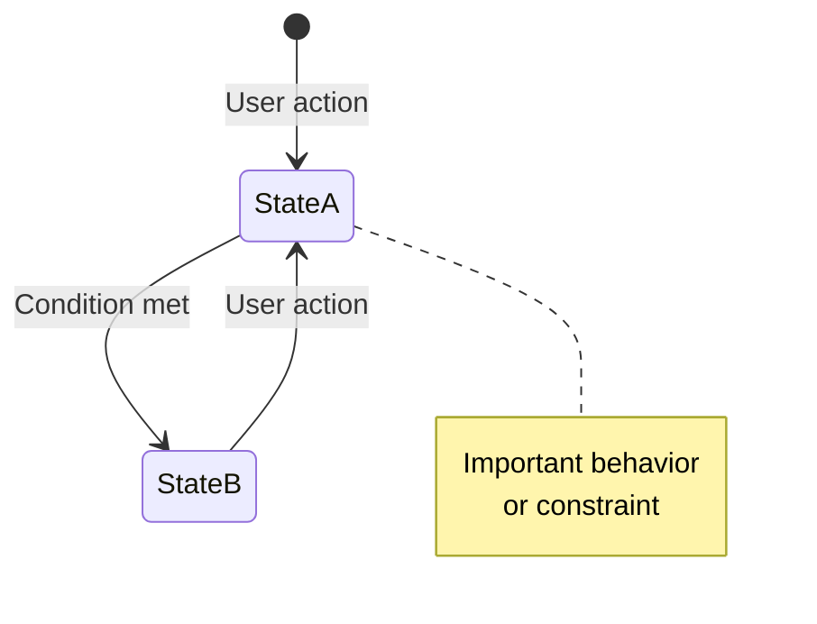

# Write Product Requirements Document

Create or update a product requirements document that serves as the source of truth for product behavior and functionality.

## Document Structure

The document must contain exactly three sections:

1. **App Summary** - Brief overview (what, who, where)
2. **Design Principles** - 3-5 high-level principles guiding the design
3. **Requirements** - Comprehensive functional and non-functional requirements

## Requirements for App Summary

- Single paragraph describing core function
- Target users and use cases
- Platform and context (device types, environments)
- Keep under 10 bullet points total

## Requirements for Design Principles

- 3-5 principles maximum
- Each principle: short heading + 3-5 bullets
- Capture the "why" behind design decisions
- Examples: Accessibility First, Cognitive Simplicity, Deliberate Safety

## Requirements for Requirements Section

### Functional Requirements

**Must capture:**

- All user-facing features and behaviors
- All UI screens and their states
- All user interactions and their outcomes
- Data and content (categories, options, fixed values)
- Error handling and edge cases

**Organization:**

- Group by feature area (FR1, FR2, FR3...)
- Sub-number within features (FR1.1, FR1.2...)
- Use descriptive headings

### Non-Functional Requirements

**Must capture:**

- Platform constraints (OS, device types, orientation)
- Accessibility requirements (touch targets, contrast, cognitive load, motor control)
- Interaction constraints (input methods, complexity limits)
- Performance and reliability expectations

### State Diagrams

**Required:**

- Include 1+ Mermaid state diagrams showing state transitions
- Diagram user interactions triggering state changes
- Show relationships between independent state machines
- Add notes for important behaviors

Example:

### User Interface

**Describe:**

- Screen layouts (text description, no ASCII art)
- Component visual design (colors, icons, labels where essential)
- Component states (default, selected, disabled, etc.)
- Layout proportions where they affect functionality

### User Interactions

**Document:**

- Interaction sequences (step-by-step)
- Timing where it affects UX
- What persists vs what clears
- State preservation across actions

## Critical Constraints

### What to EXCLUDE

- Implementation details (no code files, component names, class names)
- Build/deployment information
- Technology stack specifics
- File structures
- "Excluded features" or "out of scope" sections
- ASCII/text-based UI diagrams (use Mermaid or text descriptions)
- Version number and last updated date

### Level of Detail Rules

**Include style details ONLY when essential for functionality:**

- ✅ "YES button is green with checkmark icon" (color conveys meaning)
- ✅ "High contrast throughout" (accessibility requirement)
- ✅ "Minimum 72dp touch targets" (accessibility requirement)
- ✅ "Long-press for 1.5 seconds to unlock" (functional requirement)

**Exclude style details that are implementation minutiae:**

- ❌ "Border stroke width is 4dp"
- ❌ "Animation duration is 300ms"
- ❌ "Font size is 36sp"
- ❌ "Padding is 24dp"
- ❌ Hex color values (#FF5733)

**Rule of thumb:** If changing the detail would NOT significantly change functionality or user experience, exclude it.

### What to INCLUDE

**Current state only:**

- Document behavior as it currently exists
- No alternatives, no "could do X or Y"
- No future enhancements or roadmap
- No design rationale in requirements (put rationale in Design Principles)

**Complete behavior:**

- Every user action and system response
- Every UI state and transition
- Every error condition
- Every persistence rule

## Writing Style

- Use bulleted lists over prose
- One concept per bullet point
- Imperative for requirements ("App must...", "User can...")
- Declarative for states ("Button is green", "Sidebar appears")
- Concise language, no filler words
- High information density

## Document Optimization

- Optimize for AI agent consumption
- Maximize clarity and token efficiency
- Each section provides unique information (no redundancy)
- Keep document under 600 lines where possible
- Use Mermaid diagrams to replace lengthy text descriptions

## Output

Save the document with:

- Filename: `PRODUCT_REQUIREMENTS.md`
- Location: Project root or `docs/` directory
- Format: Markdown with Mermaid diagrams

## Validation Checklist

Before finalizing, verify:

- [ ] Three-section structure (Summary, Principles, Requirements)
- [ ] No implementation details
- [ ] No "excluded features" section
- [ ] No ASCII diagrams
- [ ] At least one Mermaid state diagram
- [ ] All UI screens documented
- [ ] All user interactions documented
- [ ] Only essential style details included
- [ ] Current state only (no alternatives/futures)
- [ ] Appropriate level of detail throughout

<additional-instructions>
$ARGUMENTS
</additional-instructions>
