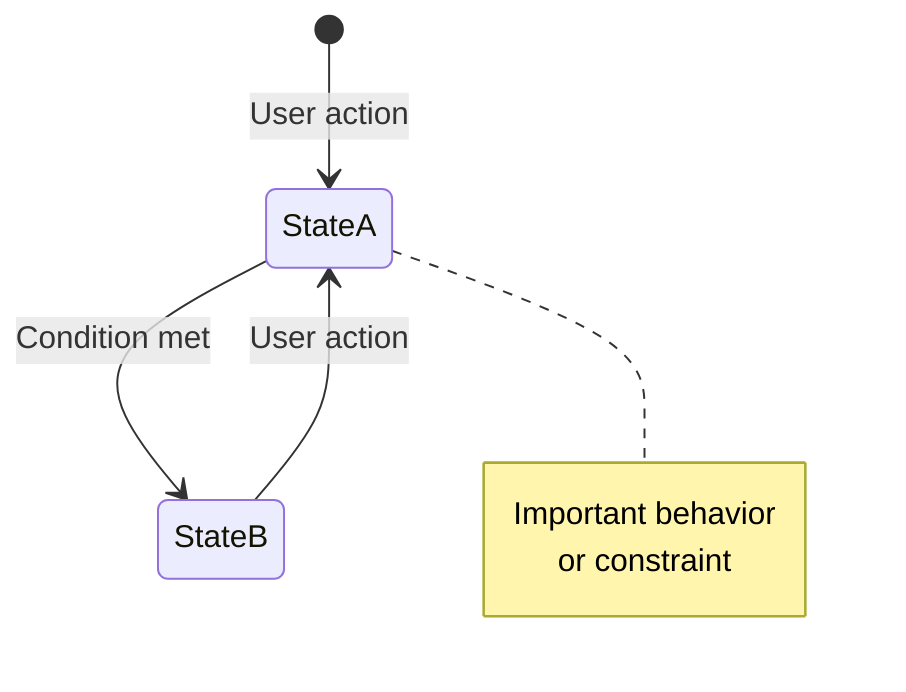

# Write Product Requirements Document

Create or update a product requirements document that serves as the source of truth for product behavior and functionality.

## Document Structure

The document must contain exactly three sections:

1. **App Summary** - Brief overview (what, who, where)
2. **Design Principles** - 3-5 high-level principles guiding the design
3. **Requirements** - Comprehensive functional and non-functional requirements

### App Summary

- Single paragraph describing core function
- Target users and use cases
- Platform and context (device types, environments)
- Keep under 10 bullet points total

### Design Principles

- 3-5 principles maximum
- Each principle: short heading + 3-5 bullets
- Capture the "why" behind design decisions — rationale belongs here, not in the requirements
- Examples: Accessibility First, Cognitive Simplicity, Deliberate Safety

## Requirements Section

### Functional Requirements

Capture all user-facing features and behaviors, all UI screens and their states, all user interactions and their outcomes, data and content (categories, options, fixed values), and error handling and edge cases.

Organization:

- Group by feature area (FR1, FR2, FR3...)
- Sub-number within features (FR1.1, FR1.2...)
- Use descriptive headings

### Non-Functional Requirements

Capture platform constraints (OS, device types, orientation), accessibility requirements (touch targets, contrast, cognitive load, motor control), interaction constraints (input methods, complexity limits), and performance and reliability expectations.

### State Diagrams

Include at least one Mermaid state diagram showing state transitions: user interactions triggering state changes, relationships between independent state machines, and notes for important behaviors.

Example:

### User Interface

Describe screen layouts in text (no ASCII art), component visual design (colors, icons, labels where essential), component states (default, selected, disabled, etc.), and layout proportions where they affect functionality.

### User Interactions

Document interaction sequences step-by-step, timing where it affects UX, what persists vs what clears, and state preservation across actions.

## Scope and Level of Detail

Describe the product, not the implementation: leave out code files, component and class names, build or deployment information, technology stack specifics, and file structures. Also omit "excluded features" / "out of scope" sections, version numbers, and last-updated dates.

Document current behavior only — no alternatives, no future enhancements or roadmap. Within that scope, be complete: every user action and system response, every UI state and transition, every error condition, every persistence rule.

Include a style detail only when it is essential to functionality or accessibility — "YES button is green with checkmark icon" belongs because the color conveys meaning. Exclude implementation minutiae such as exact padding, font sizes, animation durations, or hex color values. Rule of thumb: if changing the detail would not meaningfully change functionality or user experience, leave it out.

## Writing Style

- Use bulleted lists over prose; one concept per bullet
- Imperative for requirements ("App must...", "User can...")
- Declarative for states ("Button is green", "Sidebar appears")
- Optimize for AI agent consumption: concise, high information density, each section providing unique information
- Keep the document under 600 lines where possible; use Mermaid diagrams to replace lengthy text descriptions

## Output

Save as `PRODUCT_REQUIREMENTS.md` in the project root or `docs/` directory, formatted as Markdown with Mermaid diagrams.
