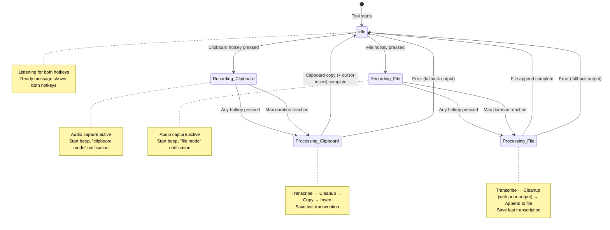
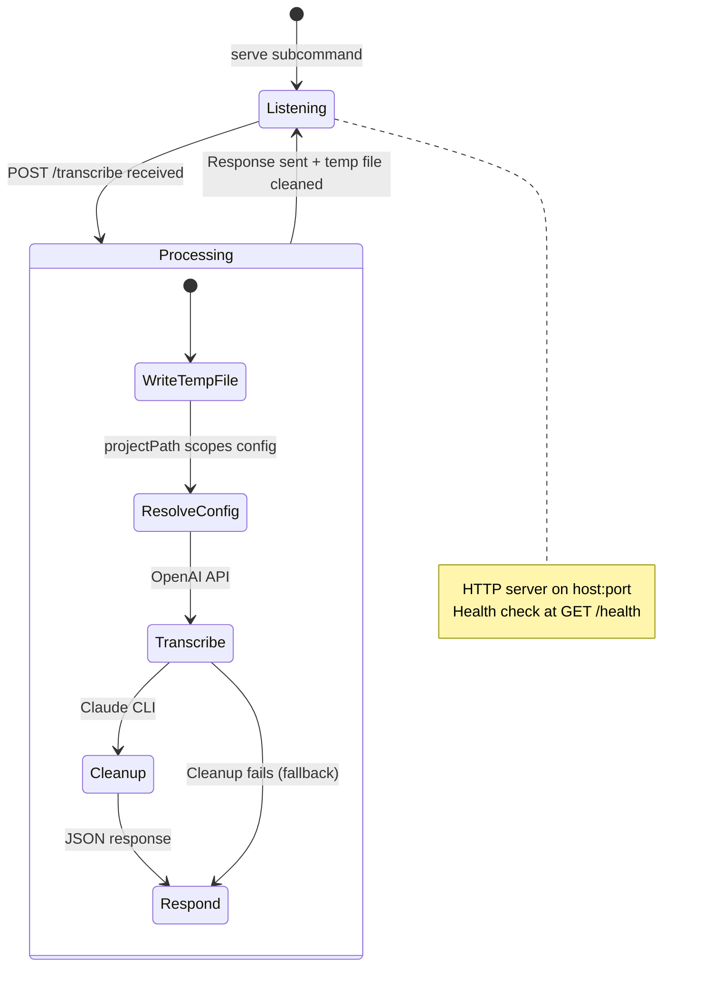

# Voice-to-Text CLI — Product Requirements

## App Summary

- Command-line tool that captures voice input and converts it to formatted text
- Two subcommands:
  - **`listen`**: long-lived foreground process with global hotkey activation for voice recording
  - **`serve`**: HTTP API server for programmatic transcription from any client
- In listen mode, user presses a global hotkey to start/stop recording from any application
- Two output modes in listen mode selected per-generation by which hotkey is pressed:
  - **Clipboard mode** (default hotkey F9): one-off transcription copied to clipboard and optionally inserted at cursor
  - **File mode** (default hotkey F10): transcription appended to a persistent output file with continuity-aware cleanup
- Audio is transcribed via OpenAI, then cleaned up and formatted via Claude
- Supports multiple audio formats: WAV, WebM, MP3, OGG, FLAC, M4A
- Target users: developers in AI-assisted workflows who dictate text frequently
- Runs on macOS and Linux desktops
- Listen mode operates entirely from the terminal with no GUI beyond system notifications
- Server mode exposes an HTTP endpoint for integration with browser extensions, editor plugins, and other tools

## Design Principles

### Invisible Integration

- Tool must work from any application without switching windows
- Global hotkey activation means the user never leaves their current context
- Output goes to clipboard and cursor position — no intermediate UI to manage
- Audio and visual feedback confirms state changes without demanding attention

### Graceful Degradation

- Every optional dependency has a fallback path
- Missing Claude CLI: raw transcription is used instead
- Missing cursor-insert tool: text is still on clipboard
- Missing global hotkey permissions: terminal input mode activates
- No failure is fatal — the user always gets usable output

### Layered Configuration

- Sensible defaults require zero configuration to start
- Project-level overrides let users tailor behavior per codebase
- CLI arguments provide one-off overrides without touching files
- Context and instructions files accumulate across layers rather than replacing

### Context-Aware Cleanup

- Domain-specific context improves both transcription accuracy and cleanup quality
- Context files teach the system project terminology and naming conventions
- Instructions files control cleanup formatting and style preferences
- Separation of "what the project is" (context) from "how to format" (instructions)

## Requirements

### FR1: Hotkey Activation

- FR1.1: Tool listens for two configurable global hotkeys: clipboard hotkey (default: F9) and file hotkey (default: F10)
- FR1.2: Supported hotkeys: F1–F12, Space, Enter
- FR1.3: Pressing either hotkey while idle starts recording; the pressed key determines the output mode for that generation
- FR1.4: Pressing either hotkey while recording stops recording and begins processing
- FR1.5: Hotkey press during processing state is ignored with a "still processing" message
- FR1.6: The two configured hotkeys must be different — tool exits with error if they match
- FR1.7: On macOS, global hotkey works via a compiled Swift binary (MacKeyServer) communicating over stdio
- FR1.8: On Linux, global hotkey reads kernel input events from `/dev/input/eventN`
- FR1.9: Linux global hotkey requires user membership in the `input` group
- FR1.10: If global hotkey is unavailable, tool falls back to terminal input mode (Enter/Space for clipboard, F for file mode)
- FR1.11: Terminal input mode requires the terminal window to have focus

### FR2: Audio Recording

- FR2.1: Records microphone audio using system tools (sox on macOS, arecord on Linux)
- FR2.2: Audio is captured as 16kHz, mono, 16-bit PCM
- FR2.3: Raw PCM data is encoded to WAV format before transcription
- FR2.4: Recording has a configurable maximum duration (default: 300 seconds)
- FR2.5: When max duration is reached, recording stops automatically and processing begins
- FR2.6: Temporary audio files are cleaned up after processing, including on errors

### FR3: Transcription

- FR3.1: Audio is sent to OpenAI's `gpt-4o-transcribe` model for speech-to-text
- FR3.2: Requires `OPENAI_API_KEY` environment variable — tool exits with error if missing
- FR3.3: If context files exist, their contents are included as a transcription prompt to improve domain term recognition
- FR3.4: Context is provided as hints only — it must not alter, add to, or reinterpret what was spoken
- FR3.5: Supported audio formats: WAV, WebM, MP3, OGG, FLAC, M4A
- FR3.6: MIME type is determined from the file extension; unrecognized extensions default to WAV

### FR4: Text Cleanup

- FR4.1: Transcribed text is passed to the Claude Code CLI (`claude -p`) for cleanup
- FR4.2: Cleanup prompt includes the transcription wrapped in XML tags
- FR4.3: Cleanup fixes transcription errors, improves clarity, adds markdown formatting, and structures text as paragraphs or lists
- FR4.4: Context files are injected into the cleanup prompt with source-labeled XML tags (global, project, config, custom)
- FR4.5: Instructions files are injected before default instructions so custom rules take priority
- FR4.6: A specific Claude model can be configured for cleanup via `claudeModel` option
- FR4.7: If Claude CLI is not installed, fails to execute, returns non-zero exit, or produces empty output, the raw transcription is used as fallback
- FR4.8: In file mode, the cleanup prompt uses a continuity-aware template that includes the tail of the output file (up to 8000 characters) as prior context
- FR4.9: The file-mode cleanup prompt instructs the model to continue naturally from where the prior content ends, maintaining consistent terminology, style, and tone
- FR4.10: The file-mode cleanup output must contain only the new text to append — no repetition of prior content

### FR5: Output

- FR5.1: Output mode is determined per-generation by which hotkey was pressed (FR1.3)
- FR5.2: **Clipboard mode**: cleaned text is copied to the system clipboard
- FR5.3: **Clipboard mode**: if auto-insert is enabled, text is also typed at the current cursor position
- FR5.4: Cursor insertion uses platform-specific tools: `osascript` (macOS), `xdotool` (Linux X11), `wtype` (Linux Wayland)
- FR5.5: If the cursor insertion tool is unavailable, insertion fails silently — text remains on clipboard
- FR5.6: Auto-insert can be disabled via configuration
- FR5.7: **File mode**: cleaned text is appended to the output file (default: `voice-output.md` in cwd)
- FR5.8: **File mode**: if the output file does not exist, it is created lazily on first write
- FR5.9: **File mode**: successive appends are separated by a blank line (`\n\n`)
- FR5.10: The output file path can be configured via `outputFile` in config or `--output-file` CLI argument
- FR5.11: `--clear-output` flag clears the output file on startup
- FR5.12: Both modes save the last transcription to `.voice-last.json` in the current working directory (for future correction support)
- FR5.13: The last-transcription file stores the cleaned text, timestamp, and output mode; it is overwritten on each generation

### FR6: Feedback

- FR6.1: Audio beeps play on recording start, recording stop, and processing complete
- FR6.2: Desktop notifications appear for: recording started, processing, done, and errors
- FR6.3: Terminal output shows timestamped status messages and text previews (first 50 characters)
- FR6.4: Each feedback channel (beeps, notifications, terminal output) can be independently disabled
- FR6.5: Verbose mode (`--verbose`) logs full config resolution, transcription prompts, complete results, and cleanup prompts

### FR7: Configuration

- FR7.1: Configuration is resolved from four layers (highest to lowest priority):
  1. CLI arguments
  2. Config file specified via `--config <path>`
  3. Local `voice.json` in the current working directory
  4. Global config at `~/.config/voice-to-text/config.json`
- FR7.2: Regular config keys (hotkey, fileHotkey, autoInsert, etc.) override per-key from higher layers
- FR7.3: File-path keys (contextFile, instructionsFile) accumulate across all layers — duplicates are deduplicated
- FR7.4: The `outputFile` key uses last-defined-wins semantics (not accumulation), with per-layer path resolution
- FR7.5: Relative file paths are resolved relative to their originating config file's directory
- FR7.6: When a `projectDir` is specified (by server mode's `projectPath` parameter), the local config layer loads `voice.json` from that directory and resolves relative paths against it, instead of using the process working directory
- FR7.7: Invalid JSON or failed Zod validation in a config file produces a stderr warning and the file is skipped
- FR7.8: The installer creates the global config file with all defaults
- FR7.9: Config schema keys: `hotkey`, `fileHotkey`, `contextFile`, `instructionsFile`, `outputFile`, `claudeModel`, `autoInsert`, `beepEnabled`, `notificationEnabled`, `terminalOutputEnabled`, `maxRecordingDuration`
- FR7.10: CLI arguments (`listen` subcommand): `--hotkey`, `--file-hotkey`, `--context-file`, `--instructions-file`, `--output-file`, `--claude-model`, `--no-auto-insert`, `--no-beep`, `--no-notification`, `--no-terminal-output`, `--max-duration`, `--verbose`, `--clear-output`, `--config`
- FR7.11: CLI arguments (`serve` subcommand): `--port` (default: 7880), `--host` (default: 127.0.0.1), `--verbose`

### FR8: Listen Lifecycle

- FR8.1: Listen mode runs as a long-lived foreground process until terminated
- FR8.2: Ctrl+C (SIGINT) and SIGTERM trigger graceful shutdown
- FR8.3: Shutdown stops the hotkey listener, clears timers, and cleans up temp audio files
- FR8.4: On startup, tool displays a ready message showing both hotkeys, their modes, and the output file path

### FR9: Server Mode

- FR9.1: The `serve` subcommand starts an HTTP server for programmatic transcription
- FR9.2: Server listens on a configurable host (default: `127.0.0.1`) and port (default: `7880`)
- FR9.3: `POST /transcribe` accepts a multipart form with an `audio` file and optional `projectPath` string
- FR9.4: The `projectPath` parameter scopes config resolution to that directory — the server loads `voice.json` from the specified project directory instead of its own working directory
- FR9.5: The server pipeline is identical to listen mode: transcribe via OpenAI, then cleanup via Claude CLI
- FR9.6: If cleanup fails, the raw transcription is returned as fallback
- FR9.7: Response is JSON: `{ "text": "<cleaned text>" }` on success, `{ "error": "<message>" }` on failure
- FR9.8: `GET /health` returns `{ "status": "ok", "version": "<version>" }`
- FR9.9: Missing `audio` field or non-file value returns 400
- FR9.10: Internal errors return 500 with error message
- FR9.11: All responses include CORS headers (open origin) for browser client access
- FR9.12: CORS preflight (OPTIONS) is handled with 204
- FR9.13: Uploaded audio is written to a temp file and cleaned up after processing, including on error paths
- FR9.14: `--verbose` flag logs request details, timing, and temp file operations
- FR9.15: Requires `OPENAI_API_KEY` environment variable — server exits with error if missing

### FR10: Installation

- FR10.1: Installer checks for system dependencies (sox/arecord) and OPENAI_API_KEY
- FR10.2: Installer builds the binary from source and copies to `~/.local/bin/voice-to-text`
- FR10.3: Installer creates `~/.config/voice-to-text/` directory with default config and audio assets
- FR10.4: On macOS, installer compiles the MacKeyServer Swift binary to `~/.config/voice-to-text/bin/`

### NFR1: Platform Support

- NFR1.1: Supported platforms: macOS, Linux (X11 and Wayland)
- NFR1.2: Global hotkey works on macOS (Swift binary) and Linux (kernel input events)
- NFR1.3: Terminal fallback input mode works on all supported platforms

### NFR2: Reliability

- NFR2.1: No single service failure causes the tool to crash — all errors are caught and logged
- NFR2.2: Temporary files are always cleaned up, including on error paths
- NFR2.3: Config validation prevents malformed settings from causing runtime errors

### NFR3: Performance

- NFR3.1: Hotkey response must feel instantaneous (beep plays immediately on press)
- NFR3.2: Processing time is dominated by API calls (transcription + cleanup) — no local bottlenecks
- NFR3.3: Linux hotkey polling uses 50ms intervals with non-blocking I/O

### NFR4: Dependencies

- NFR4.1: Runtime: Bun (TypeScript execution and compilation)
- NFR4.2: Required: `OPENAI_API_KEY` environment variable
- NFR4.3: Required audio tools: sox (macOS) or alsa-utils/arecord (Linux)
- NFR4.4: Optional: Claude Code CLI (for text cleanup)
- NFR4.5: Optional cursor insertion tools: osascript (macOS), xdotool (Linux X11), wtype (Linux Wayland)
- NFR4.6: Optional: `input` group membership (Linux global hotkey)
